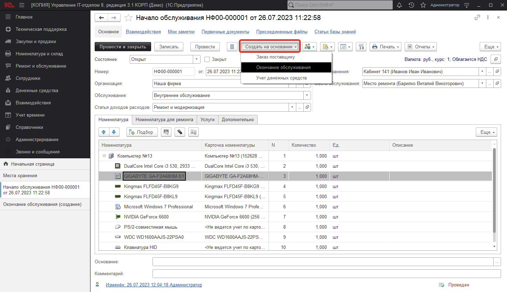
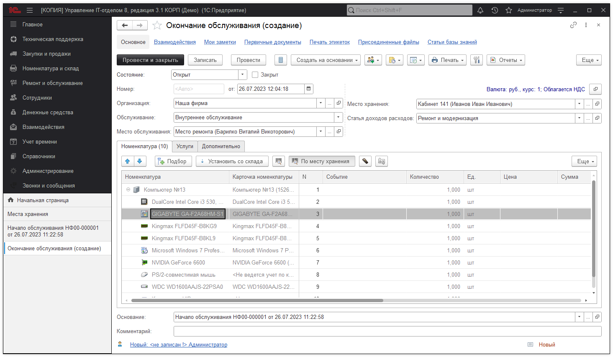
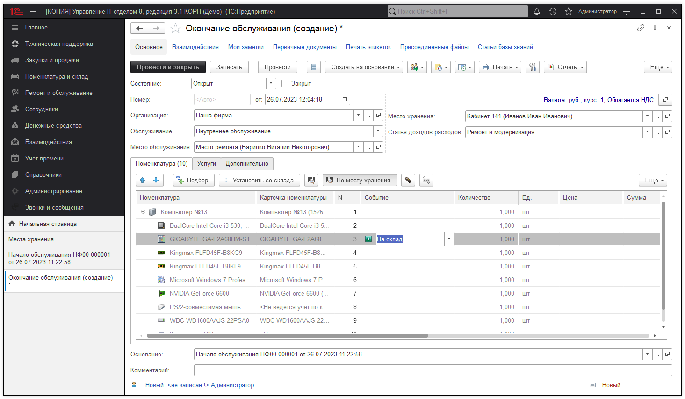
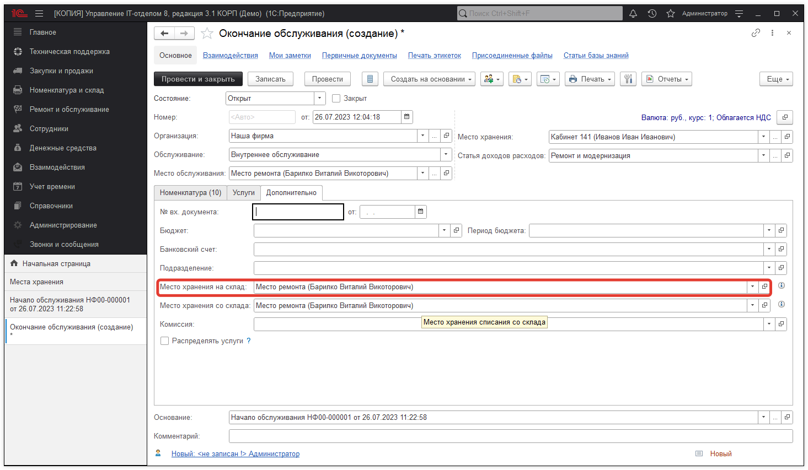
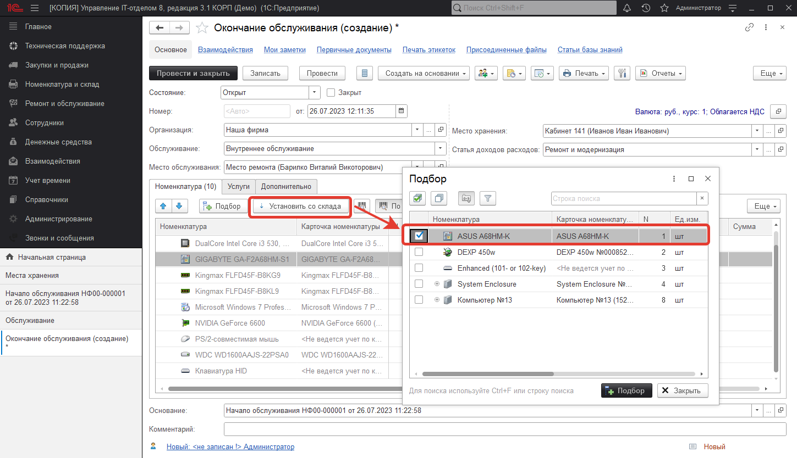
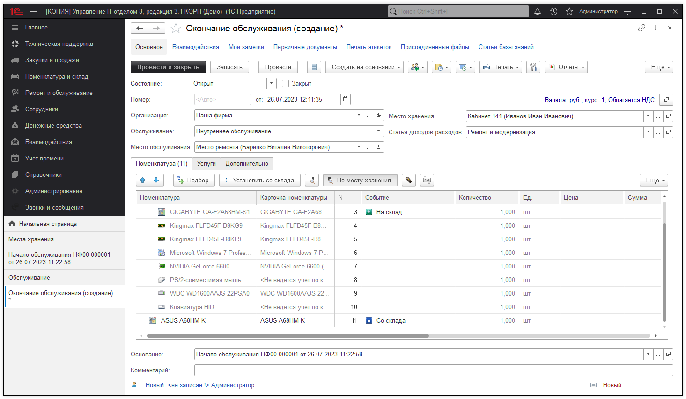
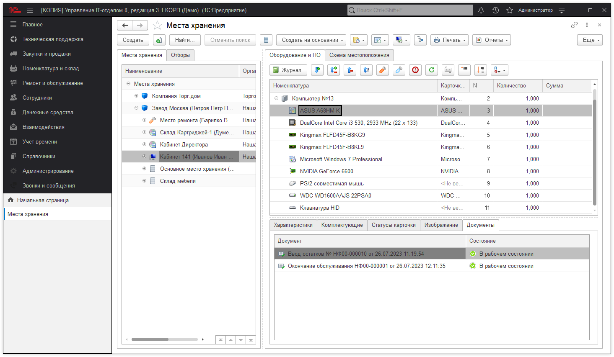

# Окончание обслуживания

Документ **"Окончание обслуживания"** предназначен для фиксирования факта ремонта оборудования или его обслуживания или возврат от контрагента, оборудования, которое он ремонтировал(обслуживал).

Продолжим решать поставленную задачу рассмотренную на предыдущем этапе.

Итак, мы переместили системный блок со сгоревшей материнской платой на место ремонта, теперь необходимо заменить плату на другую.

Для этого на основании документа "Начало обслуживания" создаем документ "Окончание обслуживания".

Это операция позволит в документе "Окончание обслуживания" не заносить данные по новой. Будет создан документ следующего содержания:

Теперь необходимо в нем заменить сгоревшую материнскую плату. Для этого в поле **"Событие"** необходимо выбрать **"Списание"** - если надо списать комплектующую в процессе ремонта, или "На склад", в случае если мы позже попытаемся выяснить причину поломки, и кто знает, может починим комплектующую. Выберем "На склад".

При этом Вы должны понимать, что комплектующие с видом события "На склад", будут помещены на место хранения, которое указано на закладке **"Дополнительно": "Место хранения на склад"**.

В нашем случае мы поместим ее в **"Место ремонта"**.

Так же есть реквизит "Место хранения со склада", он предназначен для указания с какого места хранения будут устанавливаться комплектующие. И в этом случае это тоже "Место ремонта".

Выбрали место хранения со склада, теперь добавим новую материнскую плату:

Понятное дело, что новая материнская плата должна находиться на **"Место хранения со склада"**.

После подбора, необходимо перетащить установленную комплектующую мышкой в тот комплект, в котором она будет укомплектована. В нашем случае это "Компьютер №13".

Вот, что получилось:

Т.е. в данном документе видно, что мы перемещаем на место, где будет проходить ремонт "Место ремонта" (указан на закладке "Дополнительно") материнскую плату  GIGABYTE GA-F2A68HM-S1 и ставим новую со склада "Место ремонта" (указан на закладке "Дополнительно") ASUS A68HM-K. После нужно отнести системный блок на то место, куда его необходимо вернуть.

Проводим документ и вот, что получилось:

Как видим вместо старой сгоревшей материнской платы, у нас ASUS A68HM-K, что, собственно, нам и нужно было.

!!!
**Важно!** Хотелось бы еще добавить следующее... Мы сделали этот пример с использованием двух документов: **"Начало обслуживания"** и **"Окончание обслуживания"**. Очень часто бывают такие ситуации, при которых ремонт или обслуживание происходят на месте. Например, принесли картридж и просто поменяли его. Для таких случаев можно не делать документ "Начало обслуживания". В реквизите обслуживания документа "Окончание обслуживания" выберите "Внутреннее обслуживание произведено сразу" или "Обслуживание контрагентом произведено сразу" в таком случае можете сразу произвести ремонт.
!!!