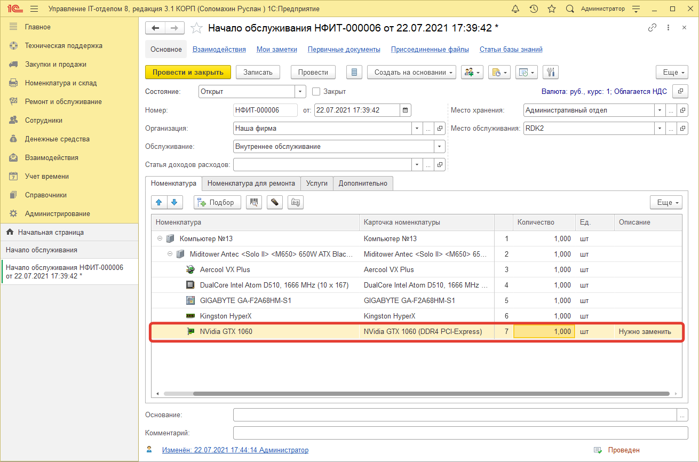
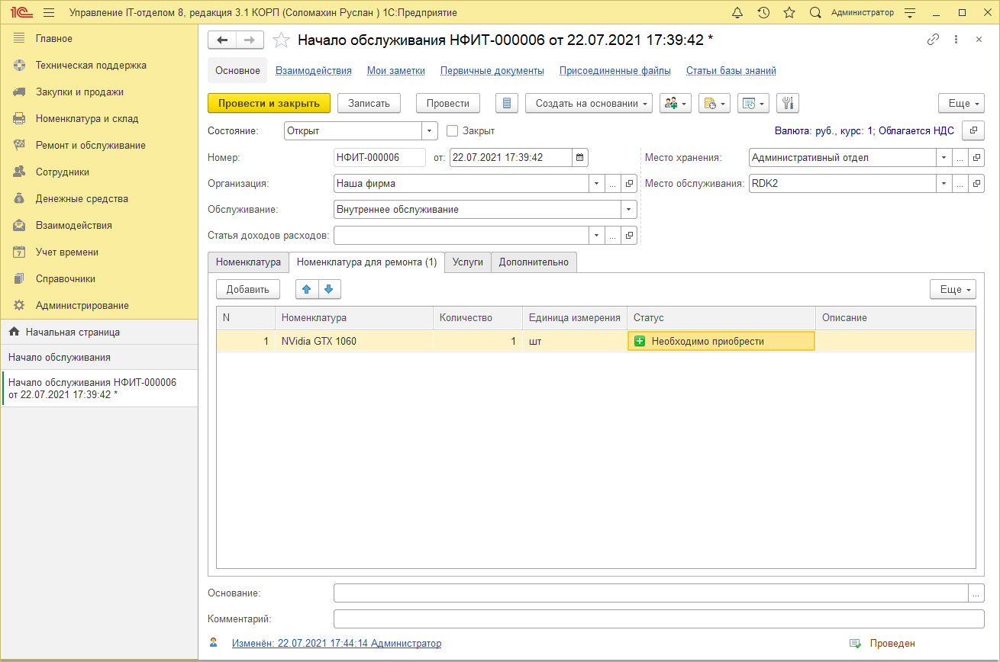
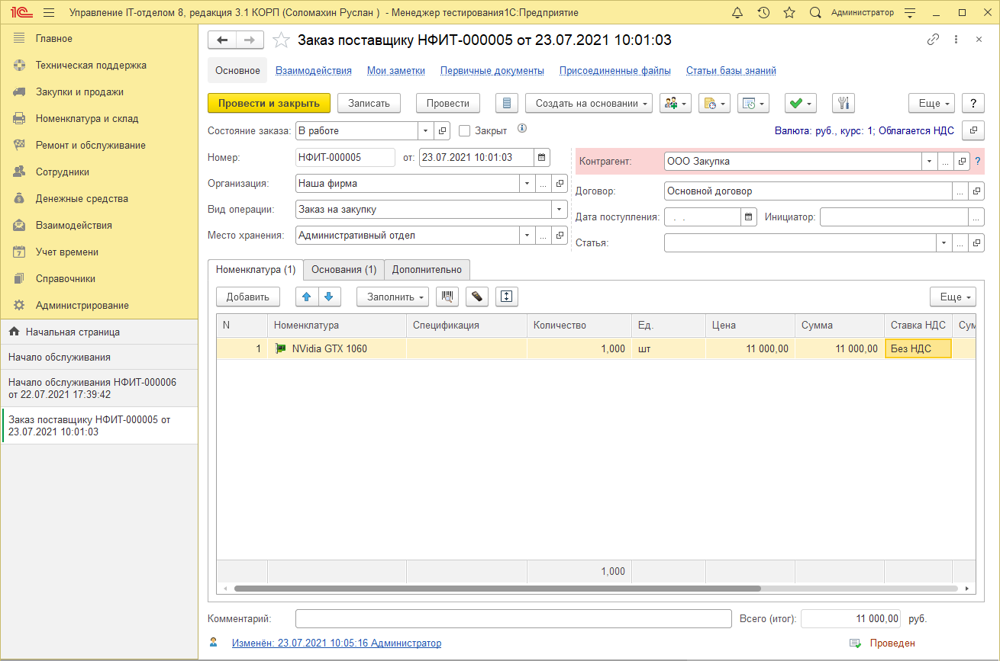

# Покупка деталей для ремонта

Зачастую при осуществлении ремонта того или иного оборудования на складке как на зло нет необходимой детали, которая нужна для починки. Ее необходимо заказывать и только после этого приниматься за работу. Мы предусмотрели данную ситуацию и добавили в документ "Начало обслуживания" новую табличную часть "Номенклатура для ремонта", позволяющую отражать комплектующие необходимые для выполнения ремонтных работ. В данной статье рассмотрим пример правильного отражения подобной ситуации. Первым делом создаем новый документ "Начало обслуживания" и указываем на закладке "Номенклатура" оборудование, которое вышло из строя.

Как видно на скриншоте выше, в одном из компьютеров предприятия перестала работать видеокарта. В результате данная комплектующая требует замены, но на остатках у нас нет такой детали, ее нужно заказывать. Для этого переходим на закладку "Номенклатура для ремонта" и указываем номенклатуру, которую нужно купить.

Стоит отметить, что номенклатура добавленная на закладке "Номенклатура для ремонта" выбирается только из справочника "Номенклатура" и не подтягивает с собой карточку номенклатуры, что позволяет указывать в столбце "количество" значение больше единицы. Также при добавлении новой номенклатуры на текущей закладке автоматически присваивается статус **"Необходимо приобрести"**, который служит отличительной чертой данной номенклатуры в документе **"Заказ поставщику"**. После того, как необходимая для ремонта номенклатура добавлена, нужно установить у данного документа реквизит "Состояние" в значение "Ожидание комплектующих", который будет сигнализировать о том, что текущий документ находится на стадии ожидания.

Следующим шагом нужно на основании документа **"Начало обслуживания"** создать **"Заказ поставщику"** и продолжить цепочку оформления документов покупки и оприходования купленного оборудования.

