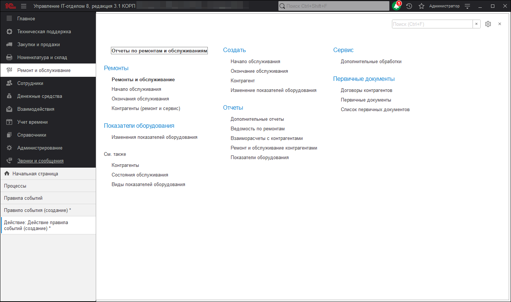

# Ремонты и обслуживание

Подсистема "Ремонты" позволяет производить обслуживание и ремонт оборудования собственными силами или силами сторонних организаций (контрагентов).

Подсистема состоит из трех документов и нескольких отчетов.

**Список ролей для работы с подсистемой "Ремонт и обслуживание".**
* [x] Добавление и изменение обслуживания и ремонтов;
* [x] Чтение обслуживания ремонтов.

