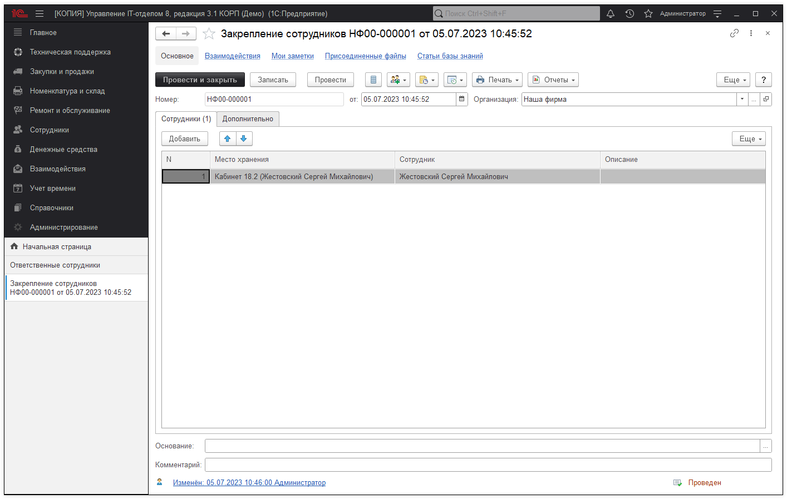

# Закрепление сотрудников

**Закрепление сотрудников** приписывает их к определенному месту хранения, например, при приеме на работу. Документ предназначен для работы с **материальными лицами**

Если используется [складской учет клиентов в аутсорсинговых компаниях](https://softonit.ru/FAQ/courses/?COURSE_ID=1&LESSON_ID=655), то вместо организации возможно выбрать контрагента, а вместо сотрудника необходимо указать контактное лицо контрагента.