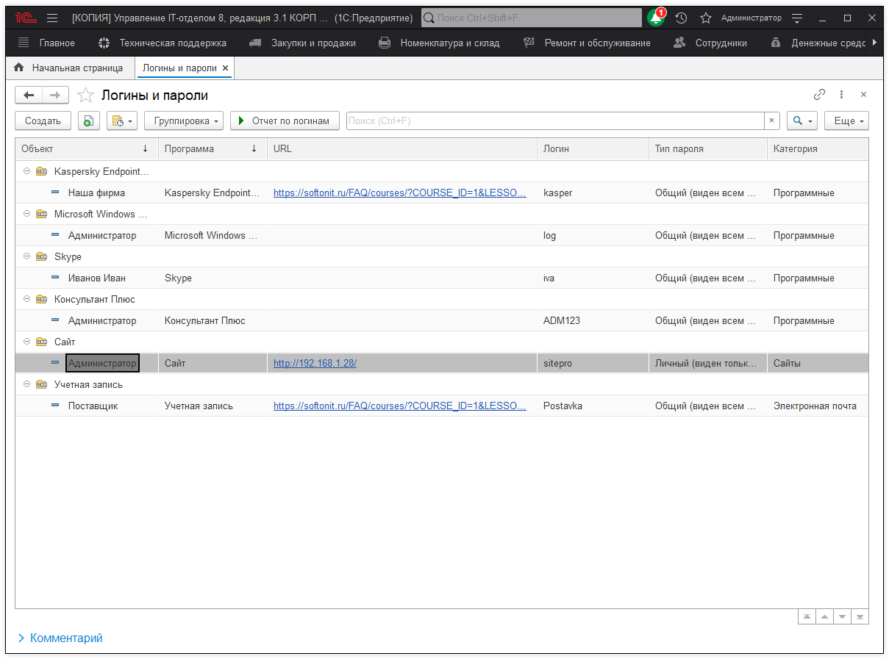
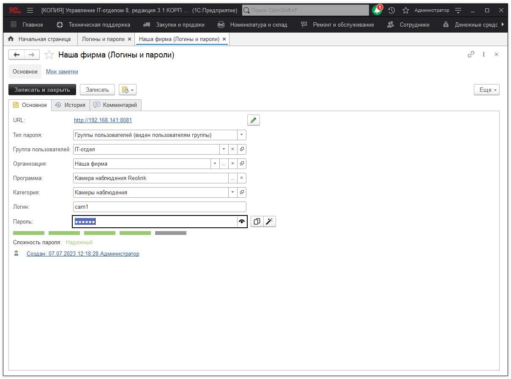
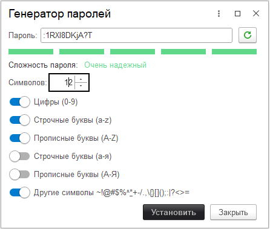
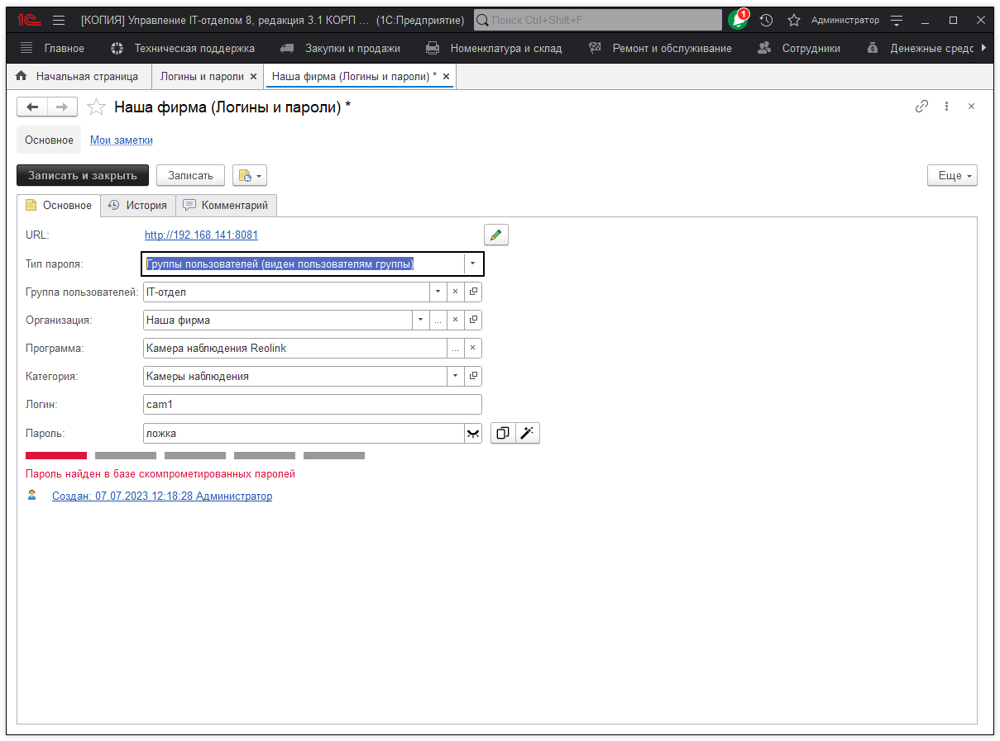
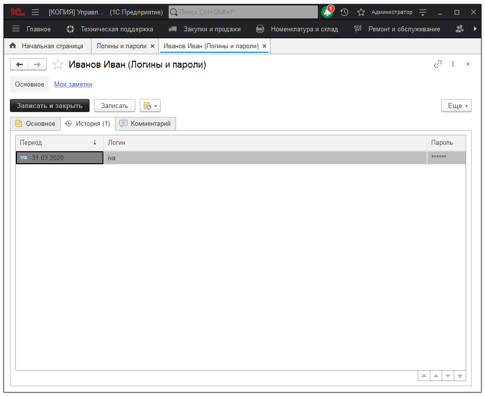
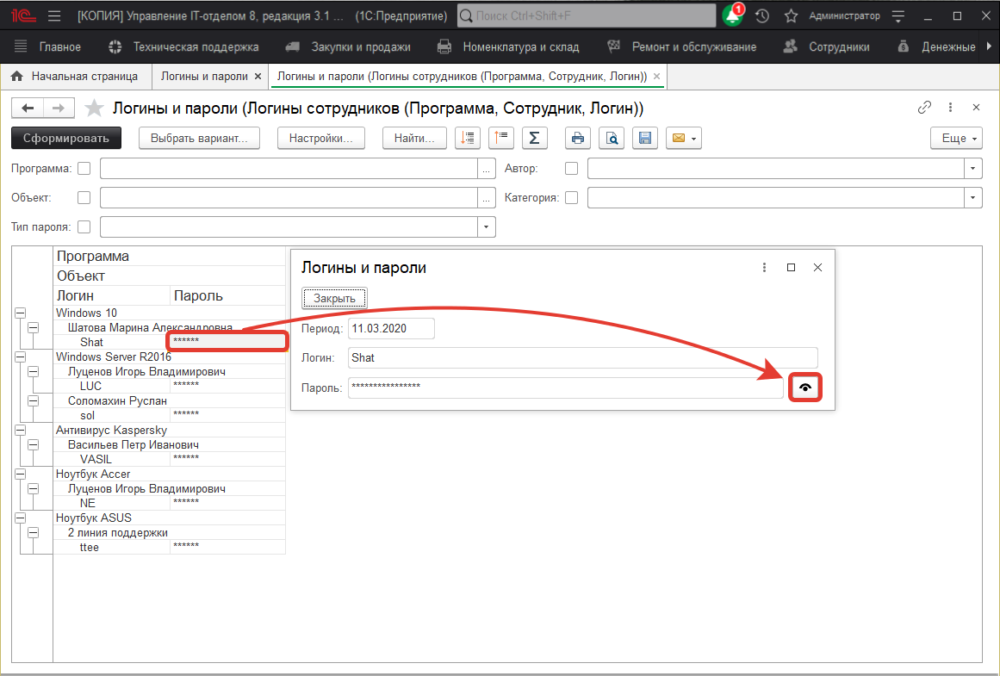

# Логины и пароли

## Зачем в нашем решении эта возможность?

Нас часто спрашивают о том, зачем эта подсистема вообще нужна? Проще ведь хранить где-то логины/пароли одному человеку и все. Но не все так просто...
Иногда в организациях есть какие-то общие логины/пароли, которые хотелось бы хранить где-то централизовано и что бы доступ к ним был для нескольких сотрудников. Например, это могут быть: данные к доступам роутеров, общих корпоративных аккаунтов или учетных записей, данные камер видео наблюдений и т.п. Эта информация часто нужна не только одному человеку и проблема осложняется тем, что пароли могут меняться со временем, как в этом случае безопасно передавать пароли?  
В этой связи, в Управление IT-отделом 8, мы добавили возможность учета паролей и постарались сделать ее удобной и безопасной на сколько это возможно.

## О безопасности хранения паролей в конфигурации

Согласно системе стандартов и методик разработки конфигураций, данный механизм работает следующим образом: информация о логине и пароле хранится отдельно от учетной карточки (это справочник "Логины и пароли"), при этом сам пароль хранится в закрытом виде (в отдельном регистре сведений в реквизите с типом "Хранилище значения"). Доступ к учетной карточке ограничивается наличием соответствующих ролей и типом пароля, но перед передачей логина и пароля с сервера на клиент, сохраненный пароль шифруется на сервере и дешифруется на клиенте при открытии формы учетной карточки. Подобное хранение паролей не решает всех проблем безопасности, а лишь усложняет задачу для злоумышленника при попытке перехвата конфиденциальной информации. В свою очередь, данный подход накладывает и свои ограничения - в форме списка справочника "Логины и пароли", а также в отчете "Логины и пароли" сами пароли отображаются в виде звездочек и не передаются на клиент. Просмотр ранее сохраненного пароля возможен из учетной карточки (вызывается из списка учетных карточек для формы списка справочника), либо открыв форму просмотра пароля.
Таким образом, пароль в открытом виде в конфигурации не хранится.

## Работа с логинами и паролями

Теперь давайте рассмотрим работу механизма "Логины и пароли" более подробно. Этот модуль позволяет упорядоченно хранить в виде журнала учета логинов и паролей пользователей, которые располагаются в форме списка справочника "Логины и пароли", а также хранить историю изменений и генерировать новые. На форме списка отображается:

* [x] **URL** - если пароль можно открыть в браузере, то здесь задается адрес сайта. Щелкнув по этому полю можно открыть сайт, каталог, FTP и т.д.  
* [x] **Объект** - объект информационной базы, к которому принадлежит логин и пароль (пользователь, сотрудник, физ. лицо, организация и т.д.);  
* [x] **Программа** - номенклатура с видом программное обеспечение или лицензия, либо произвольная строка;  
* [x] **Категория** - категория к которой относится запись логина и пароля.  
* [x] **Логин** - соответствующий логин объекта ИБ;  
* [x] **Пароль** - пароль для доступа объекта ИБ;  
* [x] **Тип пароля** - устанавливает ограничения видимости пароля (личный, общий, группы пользователей);  
* [x] **Сложность пароля** - индикатор, который указывает на сколько пароль безопасен;  

Ниже изображено окно логина и пароля. Значок "глаза" позволяет скрыть или показать пароль. На самой форме есть возможность копировать пароль в буфер обмена для дальнейшего его использования в браузере.

Если вы хотите сгенерировать пароль случайным образом, то воспользуйтесь соответствующей кнопкой **Генератор паролей** (иконка "волшебная палочка"). Окно генератора паролей позволяет задать параметры пароля и сформировать его случайным образом, а так же оценить его надежность.

Если ваш пароль будет не достаточно надежным, или скомпрометированным, то соответствующая надпись, будет сигнализировать вам об этом. Так же подобная проверка есть и в самом генераторе.

Учетная карточка помимо основной информации о логине и пароле, также хранит историю изменений данного пароля. Отображается измененный пароль в истории на следующий день, при этом будут отражены **только последние записанные изменения**. Т.е., например, сегодня вносим в течении дня ряд корректировок, последние внесенные изменения записываем и именно они на следующий день будут отображены в истории.

С помощью кнопки **"Отчет по логинам"** осуществляется переход к формированию одноименного отчета. Как говорилось в начале, пароли отображаются в виде звездочек, просмотреть пароль можно через учетную карточку или в сформированном отчете. Выбираем пароль и двойным кликом по нему вызываем форму просмотра паролей, в которой можно отобразить пароль.

**Список ролей для работы с подсистемой "Логины и пароли".**
* [x] Добавление и изменение паролей;
* [x] Чтение паролей.

**Список ролей для работы с подсистемой "Логины и пароли" в мобильном приложении**
* [x] Базовые права мобильное приложение;
* [x] Выполнение заданий;
* [x] Добавление заданий;
* [x] Чтение заданий;
* [x] Добавление и изменение паролей;
* [x] Чтение паролей.

