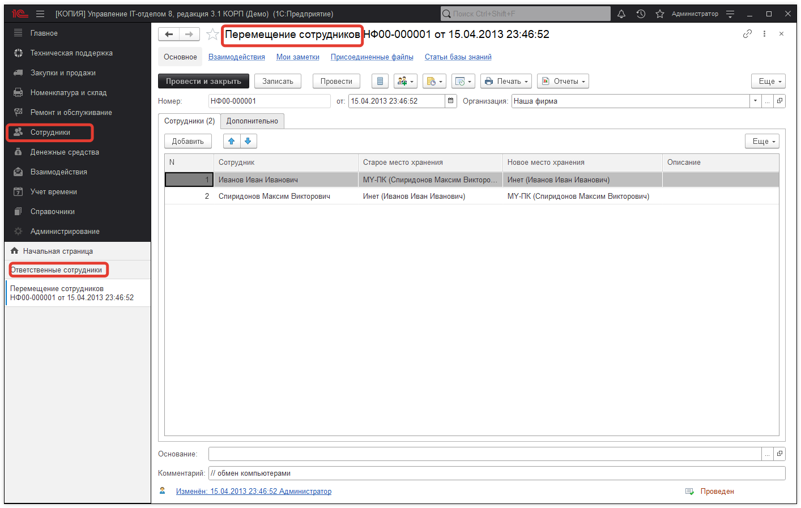

# Перемещение сотрудников

Документ **"Перемещение сотрудников"** позволяет закрепить новое место хранения за сотрудником, вместо старого.

Но при этом номенклатура ответственного сотрудника не переносится данным документом. Чтобы перенести закрепленную номенклатуру на другое место хранение нужно воспользоваться документом ["Перемещение"](https://softonit.ru/FAQ/courses/?COURSE_ID=1&LESSON_ID=55&LESSON_PATH=1.44.53.55).