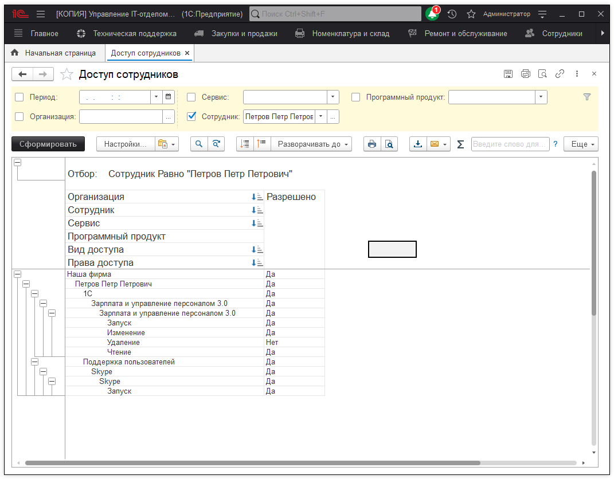
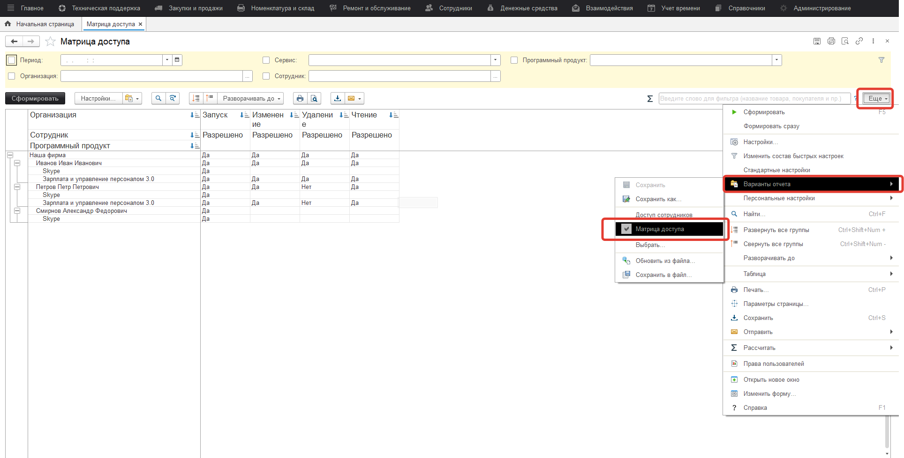

# Просмотр доступных информационных ресурсов

Иногда возникает необходимость узнать какими правами доступа к информационным ресурсам обладает тот или иной сотрудник. Например, у сотрудника вышел из строя жесткий диск, и мы не можем узнать, какие программы у него были установлены, а самое главное с какими правами. Чтобы долго и нудно это не выяснять, мы можем просто посмотреть к каким информационным ресурсам у пользователя был доступ. Для этого мы сформируем отчет **Доступ к информационным ресурсам**, который находится в подсистеме **Сотрудники**. Для формирования отчета нажмем кнопку **Сформировать**. Также можно воспользоваться сортировкой по периоду, организации, сервису, сотруднику и программному продукту.

Если же мы нажмем кнопку "Еще" можно выбрать вариант отчета "Матрица доступа":

