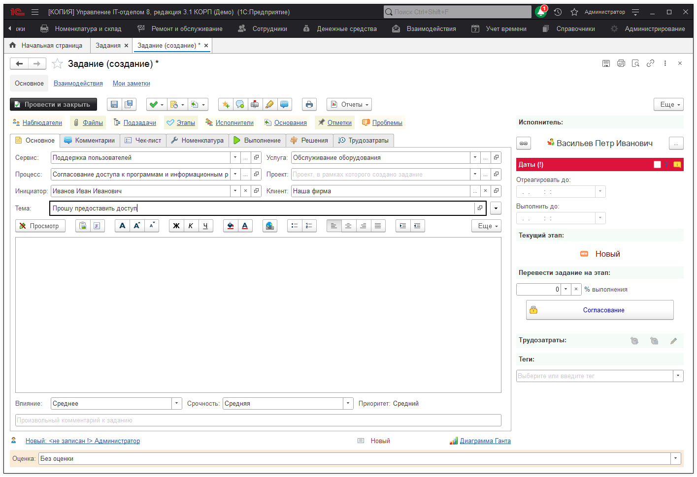
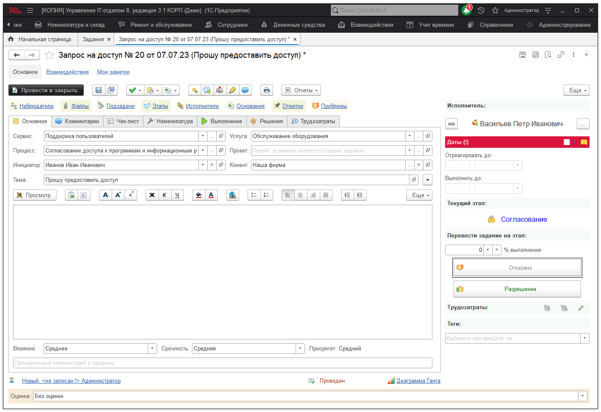
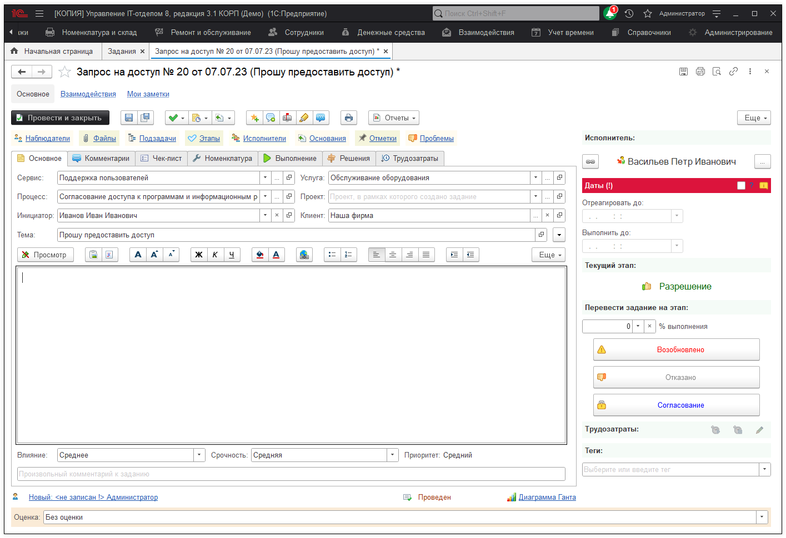
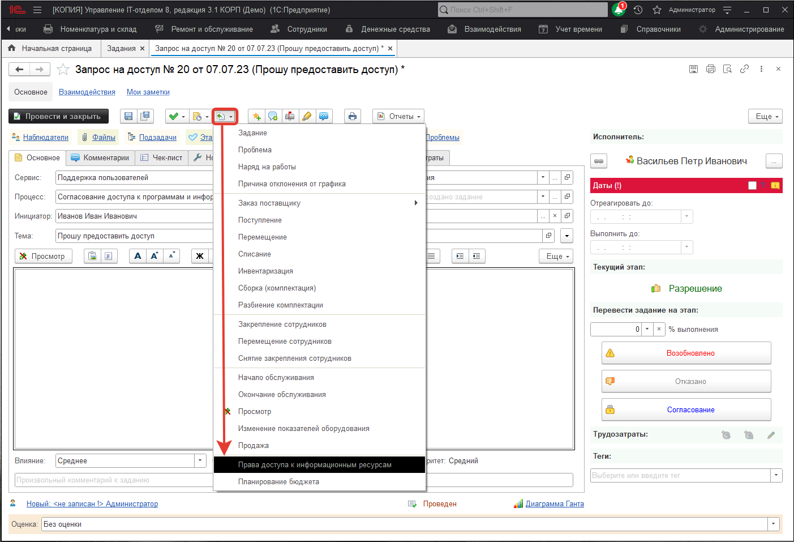
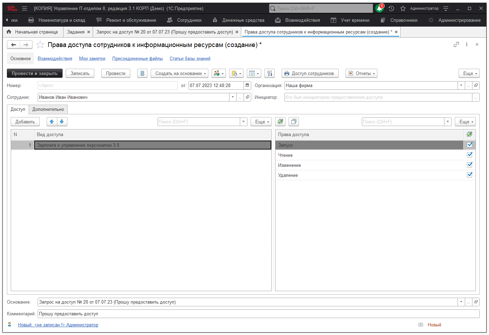

# Процесс согласования доступа

Процесс согласования доступа к информационным ресурсам начинается с подачи пользователем заявки на предоставление этого доступа. Процесс указывается "**Согласование доступа к программам и информационным ресурсам**" .

Далее переводим задание на этап **"Согласование"**. Это означает что предоставление доступа находится на рассмотрении у начальства.

Если согласование с начальством прошло успешно - переходим на этап **"Разрешение"**. В противном случае переходим на этап **"Отказано"**.

Теперь мы можем создать на основании нашего задания **"Права доступа к информационным ресурсам"** .

Выбираем сотрудника, виды доступа (можно создавать свои собственные виды доступа с разными наборами прав), отмечаем галочками **"Права доступа"** .

