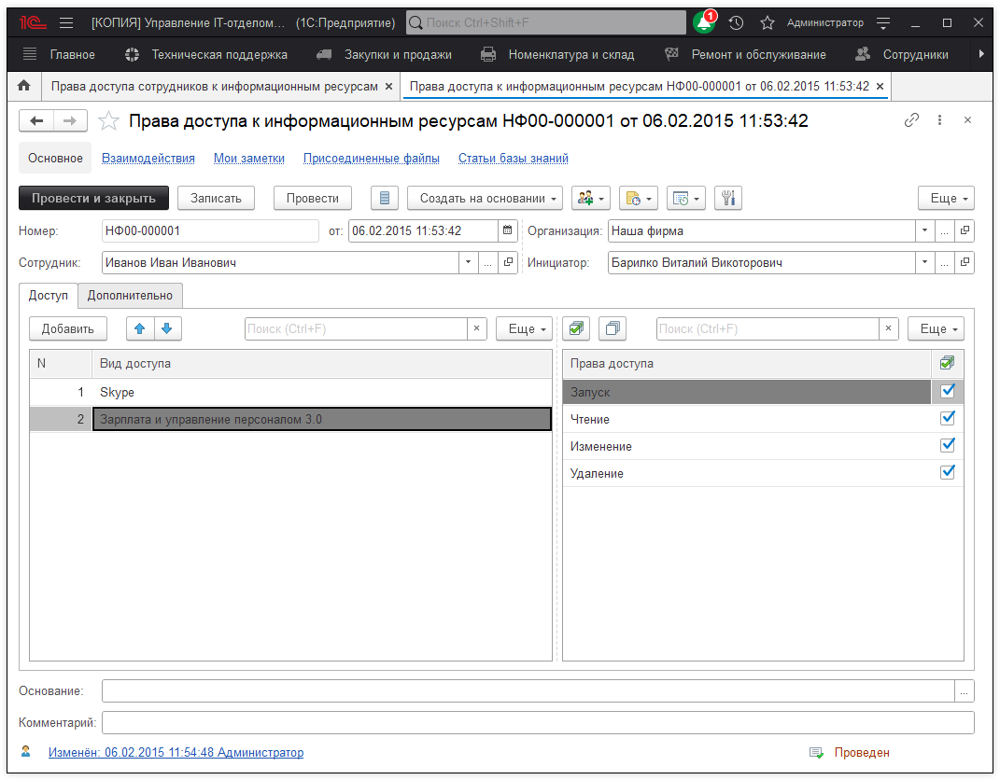
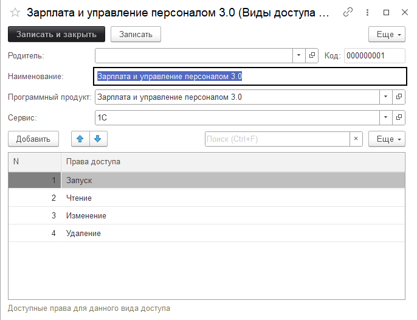

# Согласование прав доступа

При создании задания можно выбрать предопределенный процесс **"Согласование прав доступа к программам и информационным ресурсам"**. При этом сам процесс создания задания не меняется. Отличие заключается в другом наборе этапов (новый, согласование, разрешено, отказано, возобновлено). Есть возможность создать документ **"Права доступа к информационным ресурсам"** на основании задания, а также документ может быть создан в разделе *"Сотрудники"->"Права доступа сотрудников к информационным ресурсам"*. 

Вот так выглядит фиксирование у кого и куда есть доступ, и с какими правами:

**Форма элемента содержит следующие реквизиты:**

* [x] **Сотрудник** - указывается сотрудник, которому открываем доступ;
* [x] **Организация** - указывается организация;
* [x] **Инициатор** - указывается сотрудник, который является инициатором предоставления доступа.

Форма создания **"Вида доступа сотрудника к информационным ресурсам"** содержит следующий список реквизитов:

* [x] **Родитель** - выбирается "родительская" группа видов;
* [x] **Наименование** - указывается название вида;
* [x] **Программный продукт** - программа, в которой открывается доступ;
* [x] **Сервис** - сервис в рамках, которого открывается доступ к программе.
