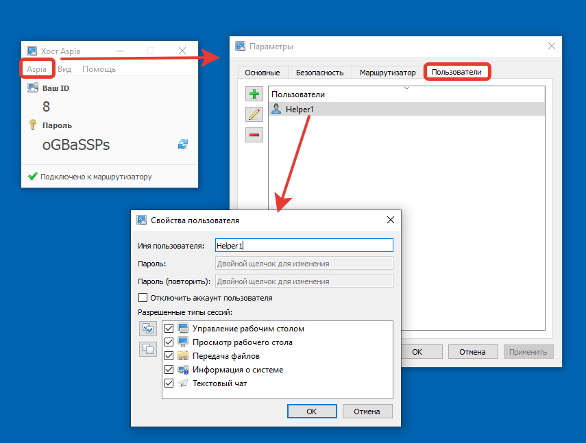
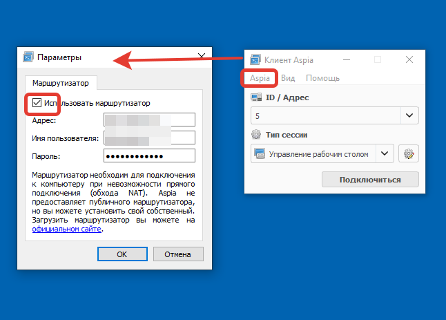
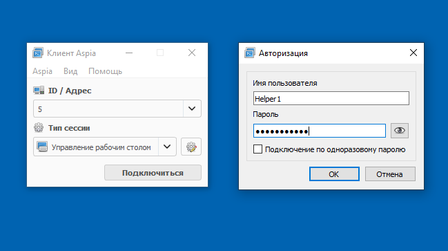
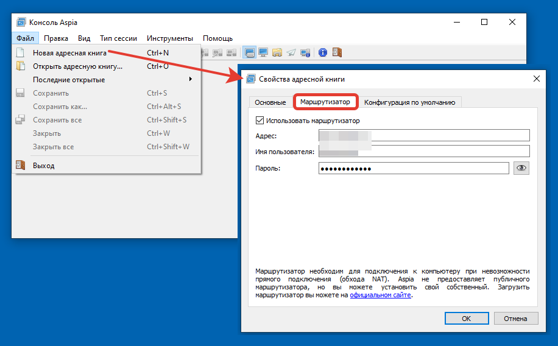
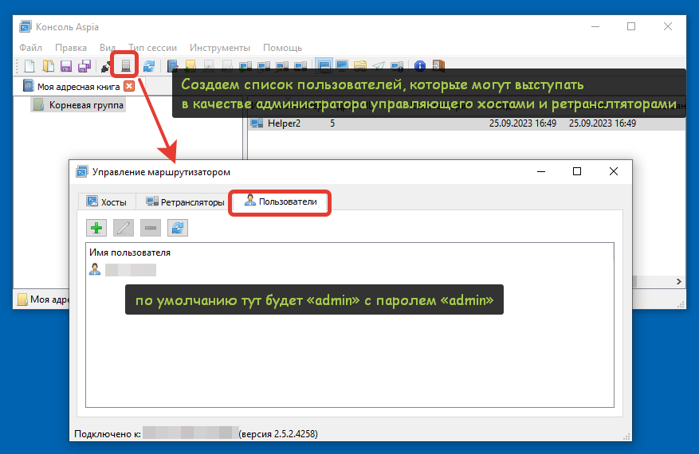
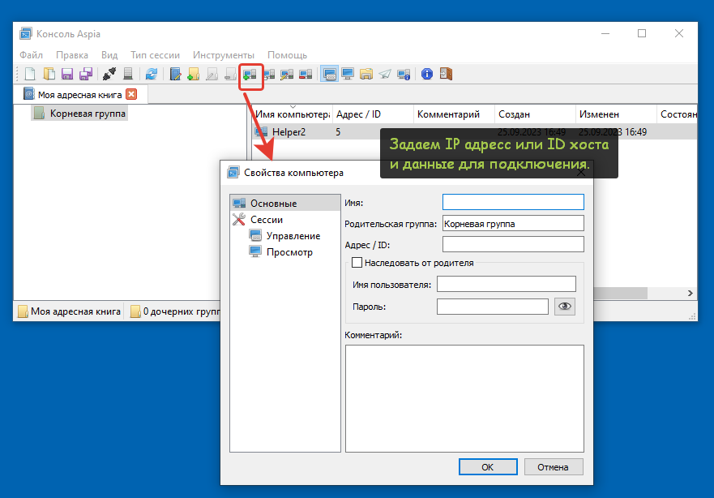
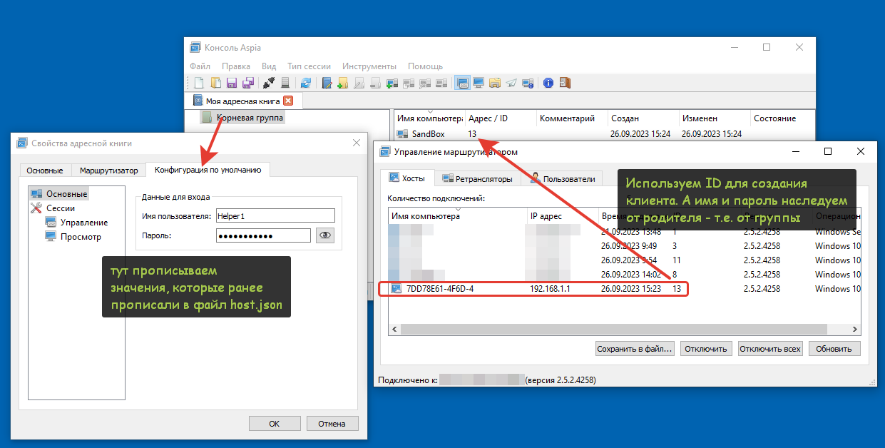

# Aspia: как использовать  

Рассмотрим основные  моменты с настройками по-умолчанию по использованию компонентов Aspia для работы с подключениями. 

## Aspia Client - Aspia Host  

В  такой связке для подключения к машине нам необходимо:
    0. Наличие **Aspia Client** на машине того, кто подключается и **Aspia Host** на машине, к которой подключаемся  - качаем здесь
1. **IP адресс** машины в локальной сети к которой производим подключение - для того, чтобы пользователь Aspia Client мог подключиться внутри периметра (в том случае, если мы не используем Aspia Router, иначе можно подключиться и по ID)
2. **Создать пользователя:** *Aspia Host - Параметры - Пользователи* - это необходимо, чтобы подключающийся хост имел определенный набор прав, предоставляемый ему

3. **Подключить маршрутизатор** -  в **Aspia Client** подключается маршрутизатор (Aspia Router), который будет идентифицировать `ID` подключения. Для этого нужно прописать IP-адрес или DNS имя машины, на которой стоит **Aspia Router**.
4. **ID** - если ранее мы настроили все необходимое для обхода NAT при внешнем подключении. Выдается автоматически вашему хосту при настройке подключения к **Aspia Router**. Используется в **Aspia Clinet** при внешнем подключении, также **может быть использован** внутри периметра сети **вместо IP** адреса машины-хоста. 
При первоначальной настройке маршрутизатора  "Имя пользователя" и "Пароль": `admin/admin`. Далее покажем как изменить это значение на собственное в **Aspia Console.**

### Подключение:   
Чтобы подключиться с  **Aspia Client** используем  **ID**(или IP - для внутренней сети) и далее: либо вводим данные пользователя, которого нам предоставит хост, либо одноразовый пароль.
* Одноразовый пароль возможно использовать только при подключении через ID
* При использовании **одноразового пароля** предоставляются **полные права**. Так что, если хотите ограничить функционал своих клиентов - создавайте пользователей в Aspia Host и предоставляйте данные для подключения.

### Aspia Console - Aspia Host
    0. Аналогично: качаем на машину-клиент Aspia Consolе, а на машину-хост Aspia Host. Качаем [здесь](https://github.com/dchapyshev/aspia/releases)  
1. **Завести адресную книгу** - для дальнейшего подключения, настройки Aspia Router и заведения списка клиентов подключения   

2. **Поменять параметры подключения к Aspia Router** - по умолчанию  имя пользователя и пароль, используемый для подключения к маршрутизатору admin/admin. Это не безопасно, поэтому рекомендуем менять на новую комбинацию.
* Для этого на панели консоли нажмите обозначенную ниже иконку и измените пользователя «`admin`», поменяв ему имя и пароль.   
* Далее вы можете создать дополнительных пользователей, которые будут иметь доступ к настройкам маршрутизатора из консоли.  

3. **Создаем пользователей, группы пользователей** - далее нам остается cоздавать пользователей в нашей адресной книге и по необходимости создавать вложенность группами компьютеров.

### Быстро подключаем пользователей

Для того, чтобы не запрашивать у каждого пользователя данные для подключения, рекомендуем создать универсальные настройки Aspia Host и распространить/предоставлять пользователям-хостам. Как это сделать:
Ниже по ссылке можно скачать авто-сборщик, который собирается с помощью `7zip SFX`(все компоненты из открытых источников):    
1. Распаковать и положить в папку aspia файл `host.json` от машины с настроенным хостом(с прописанным сервером(его ключом!), пользователями). Он лежит `c:\ProgramData\aspia\`.    
2. Запустить `aspia-make-sfx.cmd`    
3. На выходе получится авто-инсталлятор `aspia-install-252.exe`     
4. Предоставить пользователям итоговый файл - в итоге клиент сразу подключится к вашему роутеру и получит свой ID, отражаемый в "Управлении маршрутизатором" Aspia Client  
5. **Получив ID** -  у вас на руках будут все данные для создания нового пользователя в своей записной книжке: ID, имя, пароль.  
6. Подключайтесь 

[Ccылка на авто-сборщик](static/aspia-auto-install.7z)

К примеру, создайте группу пользователей и в свойствах укажите имя пользователя и пароль, которые прописали в файле host.json. Далее получив ID от вашего клиента(видно в  управлении роутером), создавайте пользователя, указав, что имя и пароль наследуются от родителя.

