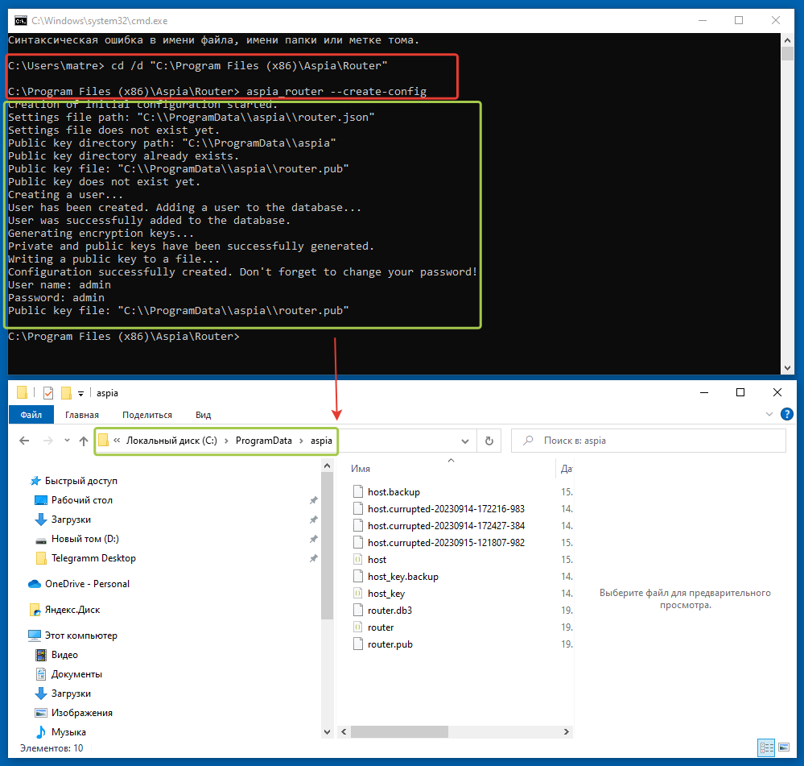
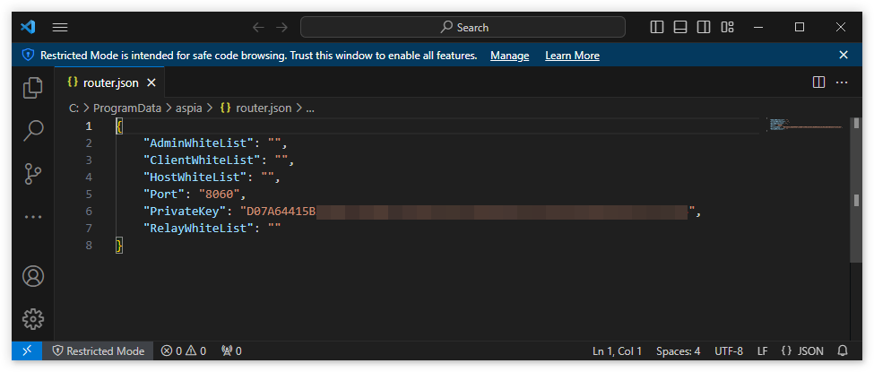
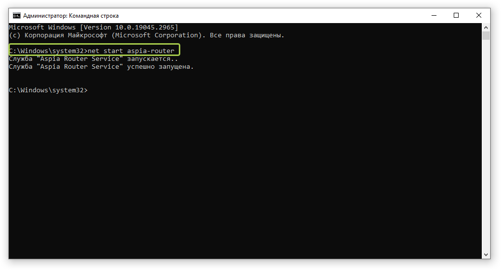
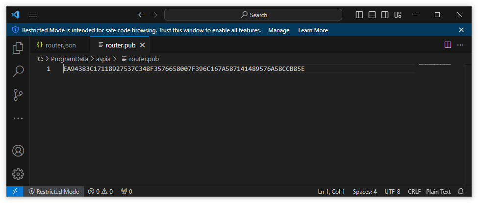
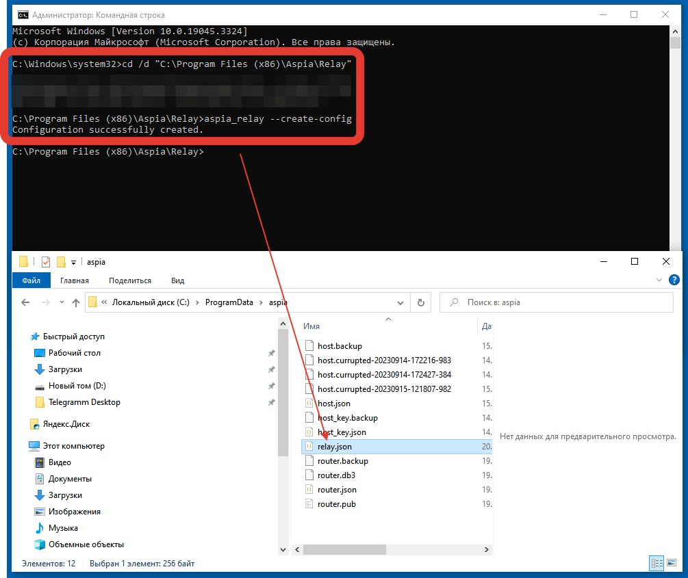
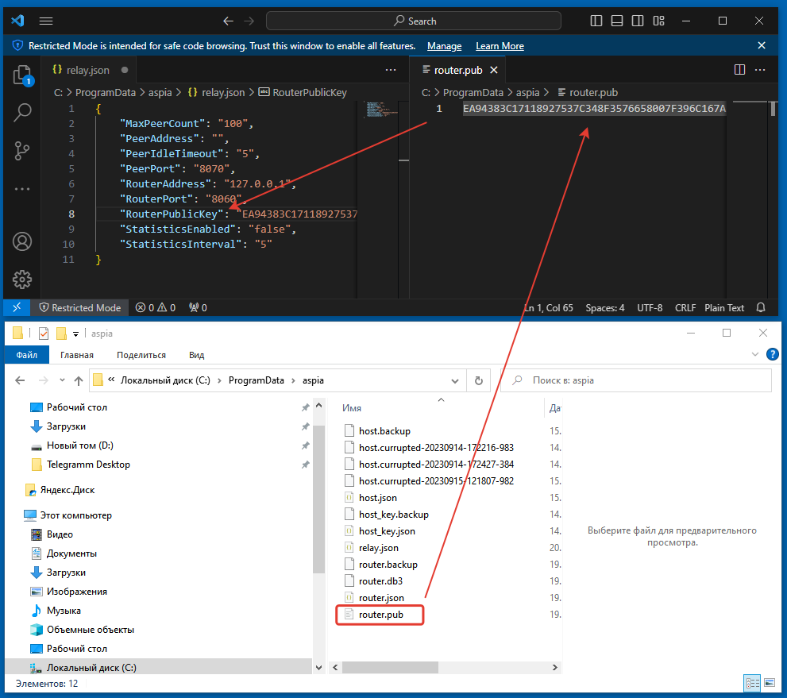
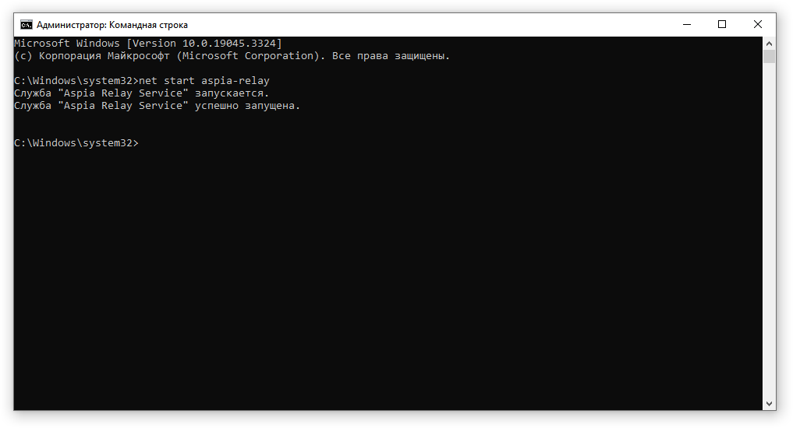
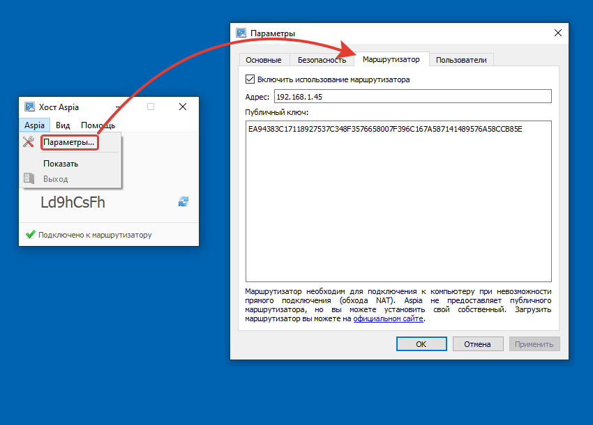

# Aspia: как настроить

## Основное отличие

Разница настройки и использования Aspia будет заключаться лишь - в необходимости для работы с внешним подключением дополнительно  установить и настроить: **Aspia Router** и **Aspia Relay** + настроить **Aspia Host** для работы с **Aspia Router**.   

Поэтому первым рассмотрим способ настройки компонентов для подключения без прямого доступа к ПК, выходящего в интернет через NAT. В остальном разницы между способами использования нет,  `Aspia Client\Console\Host` будут использоваться одинаково.

## Настройка Aspia Router

1. Cкачиваем **Aspia Router** и **Aspia Relay** с репозитория: [ссылка](https://github.com/dchapyshev/aspia/releases) . Подчеркнем еще раз, что данные компоненты доступны лишь для ОС Windows и Linux.  
2. Устанавливаем Aspia Router и Aspia Relay на сервере, который будет всегда доступен для всех хостов/консолей/клиентов. В идеале, на выделенный/виртуальный сервер у какого-либо хостера, либо на сервер внутри локальной сети с пробросом портов, **но тут есть нюанс**: 
> Aspia Router и Aspia Relay между собой могут "общаться" по любым адресам, т.е. как "`127.0.0.1`" (в случае установки на одном сервере), так и по внутренним адресам вида "`192.168.0.1`", так и по внешним (если установлены на разных хостингах, например).   
> А вот общение консоли/клиента/хоста с маршрутизатором должно осуществляться исключительно через один и тот же адрес, который будет доступен всем участникам и если у вас есть внешние клиенты (вне периметра вашей локальной сети), то необходимо обязательно указывать в конфиге внешний адрес для подключений. Из этого вытекает тот факт, что подключения по внешнему адресу фаервола изнутри локальной сети, как и проброс портов должны корректно отрабатываться.

3. **Создаем конфигурацию** по умолчанию для Aspia Router **через командную строку с правами администратора:**

* Для Windows: 
  * cd /d "C:\Program Files (x86)\Aspia\Router" 
  * aspia_router --create-config 
* Для Linux: 
  * sudo aspia_router --create-config  

!!!
**ВНИМАНИЕ!** В указанной директории не должно быть уже существующих файлов конфигурации или базы данных. Роутер никогда не перезаписывает текущие конфигурации, и создание новой конфигурации возможно только в случае отсутствия предыдущей.
!!!

4. **Заполняем конфигурационные файлы** (при необходимости; т.к. в большинстве случаев конфигурацию по умолчанию не нужно редактировать) :
* Для **Windows:**  `C:\ProgramData\aspia\router.json`
* Для **Linux:**  `/etc/aspia/router.json`
    * **PrivateKey** (ОБЯЗАТЕЛЬНОЕ ПОЛЕ): Если у вас уже есть закрытый ключ, введите его здесь. Этот параметр автоматически генерируется при создании конфигурации с помощью параметра командной строки "`--create-config`". Не изменяйте эту настройку, если вам действительно нет в этом необходимости.
    * **Port:** Порт, на котором будут приниматься входящие соединения. Вы можете оставить значение по умолчанию. Не изменяйте этот параметр, если вы не делаете это осознанно . **Значение по умолчанию - 8060**
    * **ListenInterface:** Адрес интерфейса, на котором сервер будет слушать входящие соединения. Укажите 0.0.0.0, если вы хотите прослушивать соединения на всех интерфейсах. Не изменяйте эту настройку, если вам действительно нет в этом необходимости
    * **ClientWhiteList:** Список IP-адресов (без имен хостов) клиентов, которым разрешено подключаться к роутеру. Адреса разделяются точкой с запятой. Если список пуст, то разрешены подключения от всех клиентов. Если список содержит элементы, то только клиенты, указанные в этом списке, могут подключаться. Не изменяйте эту настройку, если вам действительно нет в этом необходимости.
    * **HostWhiteList:** Список IP-адресов (без имен хостов) хостов, которым разрешено подключаться к роутеру. Адреса разделяются точкой с запятой. Если список пуст, то разрешены подключения от всех хостов. Если список содержит элементы, то только хосты, указанные в этом списке, могут подключаться. Не изменяйте эту настройку, если вам действительно нет в этом необходимости.
    * **AdminWhiteList:** Список IP-адресов (без имен хостов) администраторов, которым разрешено подключаться к роутеру. Адреса разделяются точкой с запятой. Если список пуст, то разрешены подключения от всех администраторов. Если список содержит элементы, то только администраторы, указанные в этом списке, могут подключаться. Не изменяйте эту настройку, если вам действительно нет в этом необходимости.
    * **RelayWhiteList:** Список IP-адресов (без имен хостов) ретрансляторов, которым разрешено подключаться к роутеру. Адреса разделяются точкой с запятой. Если список пуст, то разрешены подключения от всех ретрансляторов. Если список содержит элементы, то только ретрансляторы, указанные в этом списке, могут подключаться. Не изменяйте эту настройку, если вам действительно нет в этом необходимости.

 5. **Запуск/Остановка службы:**
Для **Windows**: `net start aspia-router / net stop aspia-router`
Для **Linux**: `sudo systemctl enable aspia-router; sudo service aspia-router start / sudo service aspia-router stop`

6. Откройте файл публичного ключа и скопируйте его. Он пригодится для настройки ретранслятора и хостов.
Для **Windows**: `C:\ProgramData\aspia\router.pub` 
Для **Linux**: `/etc/aspia/router.pub`

## Расположение файлов маршрутизатора

1. **Логи:** чтобы задать уровень журнала, объявите переменную окружения `ASPIA_LOG_LEVEL` со значением от 0 до 3. Уменьшение значения 
значения увеличивает количество сообщений в журнале.  
* Для **Windows**: `C:\Windows\Temp\aspia\aspia_router-*.log`
* Для **Linux**: `sudo journalctl -u aspia-router`
  
2. Настройки

Для **Windows**: `C:\ProgramData\aspia\router.json`
Для **Linux**: `/etc/aspia/router.json`

3. База данных

Для **Windows**: `C:\ProgramData\aspia\router.db3`
Для **Linux**: `/var/lib/aspia/router.db3`

### ПРИМЕЧАНИЯ:
1. Хосты и ретрансляторы подключаются к маршрутизатору с использованием открытого ключа.  
2. Клиенты и консоль подключаются с помощью имени пользователя и пароля. При управлении маршрутизаторами в консоли можно добавить дополнительных пользователей. При управлении маршрутизаторами в консоли можно добавить дополнительных пользователей.  
3. Рекомендуется регулярно создавать резервные копии конфигурационных файлов и базы данных.  
4. **Не забудьте добавить правила в брандмауэре для доступа к Маршрутизатору. Маршрутизатор не добавляет правила автоматически.**   
5. Рекомендуется ограничить список ретрансляторов, которые могут быть подключены к маршрутизатору. Внесите необходимые ретрансляторы в белый список.   
6. При деинсталляции маршрутизатор не удаляет свои конфигурационные файлы и базу данных.  
7. При обновлении маршрутизатора не забудьте сделать резервную копию конфигурационных файлов и базы данных.  
8. Информацию о том, как подключиться к маршрутизатору для управления им (включая имя пользователя и пароль), см.   
на странице использования Aspia.  
1. После изменения конфигурационных файлов необходимо перезапустить службу Router. Маршрутизатор считывает конфигурацию 
при запуске!

## Настройка Aspia Relay

**Назначение Relay:** пропускает через себя трафик между пирами (хостами и клиентами). Сервер Relay должен иметь публичный IP-адрес. Релейных серверов может быть много, и они могут располагаться на отдельных от маршрутизатора машинах. 

Маршрутизатор. Количество `Relay-серверов` может быть от одного до нескольких. Необходимо установить хотя бы один сервер Relay. 
Router и Relay могут работать только вместе.

1. **Установка Relay (требуются права администратора)**   

Для **Windows**:
* запустите `aspia-relay-2.5.2-x86.msi` и следуйте инструкциям на экране.

Для **Linux**:
* `sudo apt install ./aspia-relay-2.5.2-x86_64.deb`

2. **Создание конфигурации по умолчанию (требуются права администратора)**
Для **Windows**:  
* `cd /d "C:\Program Files (x86)\Aspia\Relay"`  
* `aspia_relay --create-config`  
* 
Для **Linux**:  
`sudo aspia_relay --create-config`

!!!
**ВНИМАНИЕ!** В каталоге назначения не должно быть существующего файла конфигурации. Relay никогда не 
перезаписывает текущие конфигурации, и создание новой конфигурации возможно только в том случае, если предыдущая конфигурация 
не существует.(другими словами: удали файл relay.cfg если он появился после создания конфига для Router)
!!!

3. **Откройте файл конфигурации и заполните поля**   
Для **Windows**:   
* `C:\ProgramData\aspia\relay.json`

Для **Linux**:  
* `/etc/aspia/relay.json`

**RouterAddress** (REQUIRED FIELD): Адрес маршрутизатора. По этому адресу сервер Relay подключается к маршрутизатору. Он может быть равен localhost (или 127.0.0.1), если маршрутизатор установлен на том же компьютере.

**RouterPort**: Если вы не изменяли порт в конфигурационном файле маршрутизатора, то это поле следует оставить со значением значение по умолчанию. Если же вы изменили конфигурацию маршрутизатора, то запишите требуемое значение. Можно оставить значение по умолчанию. Не изменяйте этот параметр, если вы не делаете этого сознательно. По умолчанию используется значение 8060.

**RouterPublicKey (REQUIRED FIELD)**: Должен содержать открытый ключ маршрутизатора, который вы получили при его установке. Введите сюда открытый ключ, который содержится в файле router.pub, созданном маршрутизатором маршрутизатором.

* **ListenInterface:** Адрес интерфейса, на котором сервер будет прослушивать входящие соединения. Укажите 0.0.0.0, если необходимо прослушивать соединения на всех интерфейсах. Не изменяйте этот параметр, если в этом нет необходимости.

* **PeerAddress (REQUIRED FIELD):** Адрес, который будут получать пиры для подключения к Relay-серверу. Это собственный адрес Relay-сервера, через который оба пира (клиент/консоль и хост) могут обращаться к нему. 

!!!
**ВНИМАНИЕ!** Этот адрес должен быть доступен всем участникам соединения(Клиент/Консоль/Хост). Следует учитывать, что оба участника соединения (Host и Client/Console) должны иметь 
возможность подключаться к этому адресу. Учитывайте это при настройке сетевого оборудования, если вы настраивать проброс портов на маршрутизаторе. Если маршрутизатор находится за NAT, то необходимо обеспечить доступ к этому адресу для внешних и внутренних соединений. Более подробную информацию о том, как обеспечить доступ к этому адресу для внешних и внутренних соединений, см. в документации к своему сетевому оборудованию. 
!!!

* **PeerPort:** Порт, через который пиры будут подключаться к Relay-серверу. Можно оставить значение по умолчанию. Не изменяйте этот параметр, если вы не делаете этого сознательно. По умолчанию используется значение 8070.

* **PeerIdleTimeout:** Время в минутах. Если в течение этого времени от пиров не поступает никаких данных, соединение разрывается прервется. Можно оставить значение по умолчанию. Не изменяйте этот параметр, если вы не делаете этого сознательно. Значение по умолчанию равно 5.

* **MaxPeerCount:** Максимальное количество одновременных соединений, устанавливаемых между пирами. Вы можете оставить значение по умолчанию. Не изменяйте этот параметр, если вы не делаете этого сознательно. По умолчанию значение равно 100.

* **StatisticsEnabled:** Включает или отключает автоматическую отправку статистики на маршрутизатор. Можно оставить значение по умолчанию. Может принимать значения: true или false. По умолчанию используется значение false.

* **StatisticsInterval:** Интервал в секундах для автоматической отправки статистики на маршрутизатор. Можно оставить значение по умолчанию. Может принимать значение от 1 до 60. По умолчанию используется значение 5.
  
4. **Запуск службы**
Для **Windows**:
* `net start aspia-relay`

Для **Linux**:
* `sudo systemctl enable aspia-relay`   
* `sudo service aspia-relay start`

5. **Остановка службы**

Для **Windows**:  
`net stop aspia-relay`

Для **Linux**:  
`sudo service aspia-relay stop`

### Расположение файлов Relay  
1. **Логи:** Чтобы задать уровень журнала, объявите переменную окружения `ASPIA_LOG_LEVEL` со значением от 0 до 3. 
значения увеличивает количество сообщений в журнале.   

Для **Windows**:
`C:\Windows\Temp\aspia\aspia_relay-*.log`

Для **Linux**:
`sudo journalctl -u aspia-relay`

2. **Настройки**

Для **Windows**:
`C:\ProgramData\aspia\relay.json`

Для **Linux**:
`/etc/aspia/relay.json`

#### ПРИМЕЧАНИЯ:
1. Не забудьте добавить правила в свой брандмауэр для доступа к Relay. Relay не добавляет правила автоматически.  
2. При деинсталляции ретранслятор не удаляет свои конфигурационные файлы.  
3. После изменения конфигурационных файлов необходимо перезапустить службу Relay. Relay считывает 
конфигурацию при запуске!   
 
## Настройка Aspia Host
  Aspia Host Назначение: позволяет принимать входящие соединения от клиентов и консолей для управления компьютером, на котором он установлен. 

1. **Установка Aspia Host**
    * Хост доступен только для операционной системы Windows.
    * Запустите файл aspia-host-2.5.2-x86.msi и следуйте инструкциям, появляющимся на экране.
2. **Включение Aspia Router в настройках**
    * Перейдите в настройки (**Aspia -> Параметры... -> Маршрутизатор**)
    * Включить использование маршрутизатора
    * Напишите адрес вашего маршрутизатора
    * Запишите публичный ключ маршрутизатора

### Логи
Для установки уровня журнала объявите переменную окружения `ASPIA_LOG_LEVEL` со значением от 0 до 3. Уменьшение значения 
значения увеличивает количество сообщений в журнале.   

Для **Windows**:   
`C:\Users\<имя_пользователя>\AppData\Local\Temp\aspia\aspia_host-*.log`    
`C:\Windows\Temp\aspia\aspia_host_service-*.log`   
`C:\Windows\Temp\aspia\aspia_desktop_agent-*.log`   

На этом настройка для работы с внешними соединениями завершена.
**Для локальной работы** достаточно будет использовать лишь Aspia Host и Aspia Cline/Console без дополнительных манипуляций по настройке.
Далее распространяем Aspia Host на машинах, к которым нужно подключаться и Aspia Client/Console на машины, с которых будем производить подключение.
Как использовать Aspia Client/Console/Host читайте на [следующей](https://softonit.ru/FAQ/courses/?COURSE_ID=1&LESSON_ID=938&LESSON_PATH=.938&clear_cache=Y) странице.

