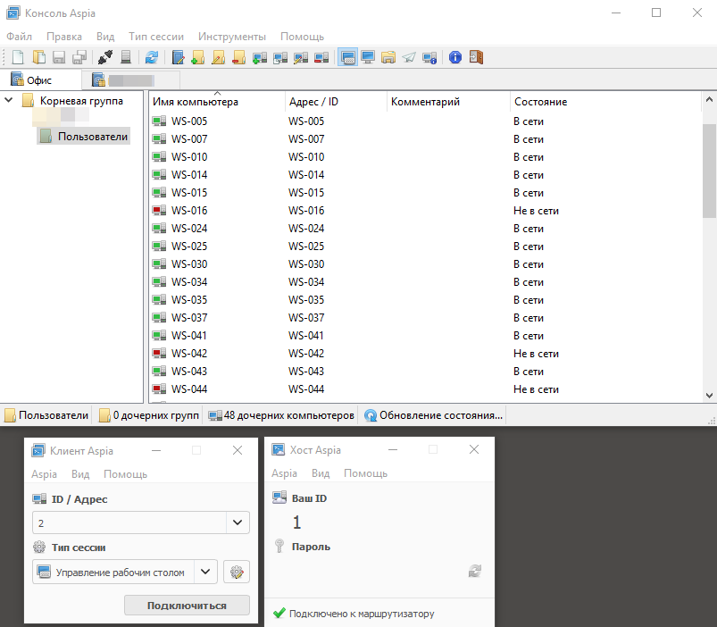
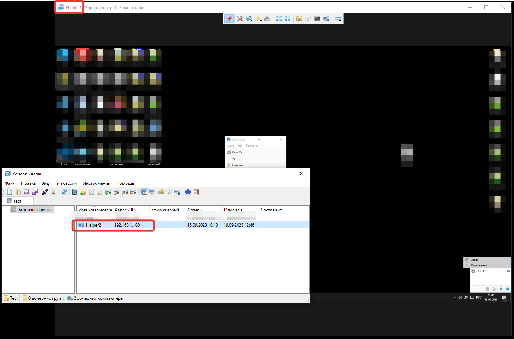
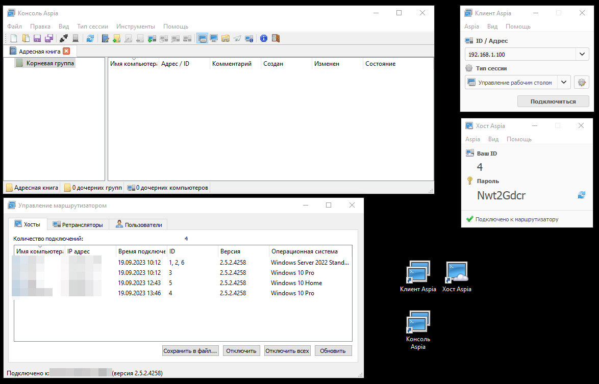
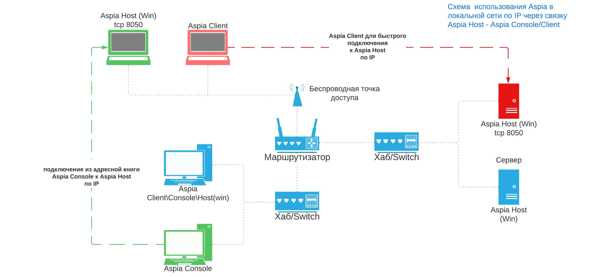
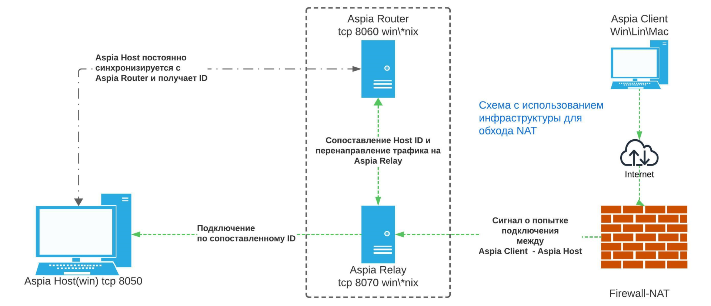

# Aspia: краткий обзор

**Aspia** - это бесплатное программное обеспечение с открытым исходным кодом, которое представляет собой полноценный набор инструментов для удаленного управления компьютерами в локальной сети и за ее пределами. Это означает, что вы сможете подключаться и контролировать компьютеры, находящиеся в других сетях, даже если они защищены сетевым адресным переводом (NAT). Aspia подобен другим популярным программам удаленного доступа, таким как `TeamViewer`, `AmmyyAdmin`, `Radmin` и `AnyDesk`. 

  

## Список возможностей программы

1. Удаленное управление с различными уровнями доступа  
2. Собственный файловый менеджер  
3. Просмотр информации о системе: оборудование, программы, службы, процессы, лицензии  и многое другое  
4. Текстовый чат между оператором и подключенным хостом  
5. Использование адресных книг с различными уровнями вложенности  
6. Aspia позволяет подключаться к компьютерам, находящимся за NAT, с помощью своего собственного ID-сервера (роутера).   
7. Балансировка нагрузки на ID-сервер с помощью нескольких Relay серверов.   
8. Поддержка операционных систем `Linux` (`Debian`, `Ubuntu`), `Windows` и `MacOS`.   

## Системные требования
1. x86 или x86_64 процессор с поддержкой инструкций SSE2   
2. Windows 7/2008 R2 или выше, Debian 11/Ubuntu 20.04, MacOS X   
3. «Белый» IP - для работы с внешним соединением в обход NAT   

###  Дополнительные требования:

* **Aspia Router: TCP 8060.** Используется для входящих подключений ретрансляторов (Aspia Relay) и сигнальных подключений хостов (Aspia Host), в т.ч. получения ID.
* **Aspia Relay: TCP 8070.** Используется для входящих подключений хостов (Aspia Host).
* **Aspia Host: TCP 8050.** Используется для входящих подключений операторов через клиентов (Aspia Client) и консолей (Aspia Console).

## Модули комплекса Aspia

* **Host** – устанавливается на компьютер, которым необходимо управлять (на данный момент только Windows).
* **Console** – устанавливается на компьютер администратора и выполняет роль клиента с адресной книгой и имеет интерфейс по управлению router’ом (поддерживаются Linux, Windows, MacOS).
* **Client** – легкий клиент, аналог консоли, с возможностью быстрого подключения к хосту (поддерживаются Linux, Windows, MacOS).
* **Router** – собственная реализация ID сервера для хостов (подключенных компьютеров), находящихся за NAT и, соответственно, не имеющих белого IP адреса (поддерживаются Linux и Windows).
* **Relay** – работает совместно с Router и служит для балансировки нагрузки. При небольших нагрузках возможно использование Router + Relay на одном физическом сервере (поддерживаются Linux и Windows).

## Режимы работы

1. **Локальный доступ:** если удаленное управление планируется использовать только лишь во внутренней сети или с машинами, подключенными через VPN, достаточно использовать связку для работы по локальной сети: **Aspia Host - Aspia Console\Client**. Подключение производится по IP-адресу машины внутри сети

2. **Внешнее соединение:** для работы с машинами вне периметра локальной сети, без доступа к ним через VPN и работающие через NAT - понадобится дополнительно установить на серверные машины **Aspia Router + Aspia Relay**
 
### Локальный доступ

Для **настройки локальной схемы** работы нам понадобится следующее:
1. [Скачать](https://github.com/dchapyshev/aspia/releases) установочный файл Aspia Client или Aspia Console в зависимости от операционной системы: `.msi` - для Win, `.deb` - для Linux, `.dmg` - для MacOS.  Между **Client** и **Console** есть значимая разница:   
    * **Aspia Client** - предназначен исключительно для быстрого подключения к удаленным компьютерам и ничего более.  
    * **Aspia Console** - предназначена для облегчения подключения к удаленным компьютерам с использованием адресной книги. Кроме того, она также позволяет управлять Aspia Router.  
2. [Скачать](https://github.com/dchapyshev/aspia/releases) Aspia Host для дальнейшей установки на машины, которыми собираемся управлять(пользовательские/сервер). Host доступен только для ОС Win.
3. Открытый порт 8050 на машине-хосте, который Aspia Host использует для входящих подключений операторов через клиентов (Aspia Client) и консолей (Aspia Console).  
4. Инструкция [как настроить Aspia](https://softonit.ru/FAQ/courses/?COURSE_ID=1&LESSON_ID=936) в локальной сети.   

* Все три компоненты(Aspia Console\Client\Host) могут находиться на одной машине, что позволит подключаться к этой машине и совершать подключения к другим машинам в локальной сети по IP-адресу.  

### Внешнее соединение

Для настройки **схемы внешнего подключения** понадобится:
1. Аналогично и для локального подключения - скачать Aspia `Clien\Console\Host`  
2. Обязательно дополнительно скачиваем **Aspia Router** и **Aspia Relay** (поддерживаются Linux и Windows) - оба продукта могут быть установлены как на одном сервере совместно, так и на разных для увеличения масштабируемости системы в целом и разделения нагрузки, в случае большого количества соединений.  
3. Дополнительно должны быть открыты порты:  
* **для Aspia Relay: TCP 8070** - используется для входящих подключений хостов (Aspia Host) , где будут установлены Router и Relay  
* **для Aspia Router: TCP 8060** - используется для входящих подключений ретрансляторов (Aspia Relay) и сигнальных подключений хостов (Aspia Host), в т.ч. получения ID.  

4. Как настроить  Aspia для внешних подключений 

## Зачем нужен Aspia Router и Aspia Relay
**Aspia Router** и **Aspia Relay** работают вместе и зависят друг от друга. **Aspia Relay** используется для передачи трафика между компьютерами, обходя **Aspia Router**. Оба продукта могут быть установлены на одном сервере или на разных серверах для увеличения масштабируемости и распределения нагрузки при большом количестве соединений.
Aspia Router функционирует исключительно как маршрутизатор и не пропускает трафик между хостом и клиентом через себя. Вместо этого он направляет трафик на Aspia Relay. Это позволяет предотвратить перегрузку своего канала и всегда быть доступным для "сигнальных соединений". Одному Aspia Router может быть подключено несколько Aspia Relay.