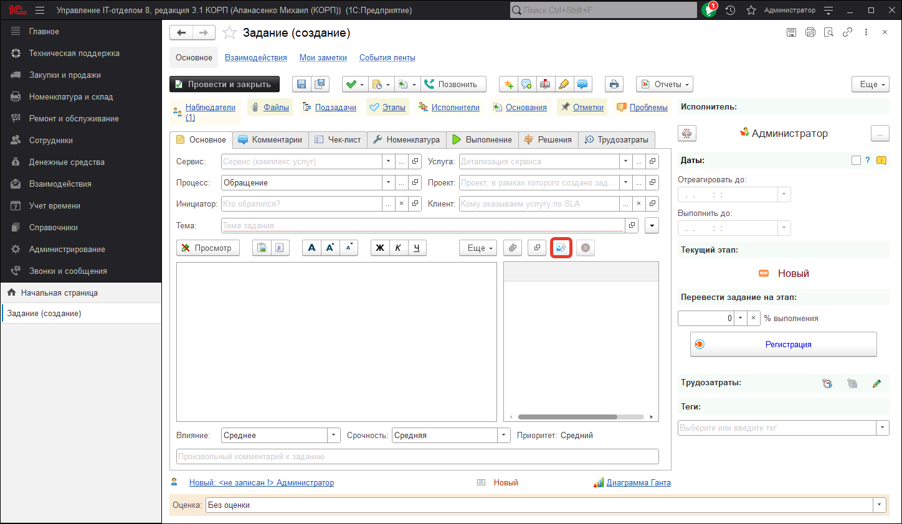
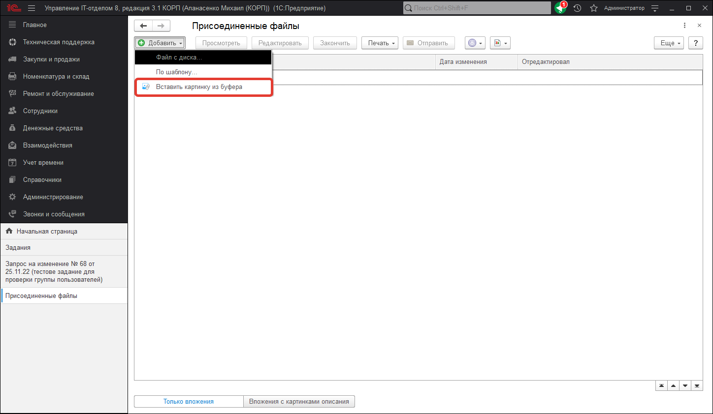

# Вставка картинок из буфера в виде файла

В конфигурации возможно вставлять изображение из буфера обмена, как присоединенного файла. Этот функционал доступен для объектов к которым можно добавлять файлы.
Рассмотрим работу этого функционала на примере документа **"Задание"**.   
Когда создали новый документ **"Задание"** , при нажатии на ссылку "Файлы" открывается таблица файлов, которые будут добавлены к документу при записи. Над этой таблицей добавлена кнопка **"Добавить скриншот"**. При ее нажатии произойдет следующее: если в буфере обмена содержится изображение, то оно будет сохранено во временное хранилище, добавится во вложенные файлы и будет сохранено во вложения. Это вложение можно так же удалить, как и другой файл. Если же сохранение документа оказалось не нужным, то при отмене документа вложения сохранены не будут.Следует отметить, что при нажатии кнопки будет показано предупреждение, что для работы с буфером обмена необходимо установить компоненту. Это сообщение выводится один раз для каждого пользователя.

Что же касается функционала добавления картинки из буфера обмена, то теперь в любом объекте, у которого доступен функционал **"Присоединенные файлы"**, появилась возможность создать файл из изображения в буфере обмена.

После выбора данного пункта меню, будет создан новый файл из картинки (если она есть в буфере обмена).
