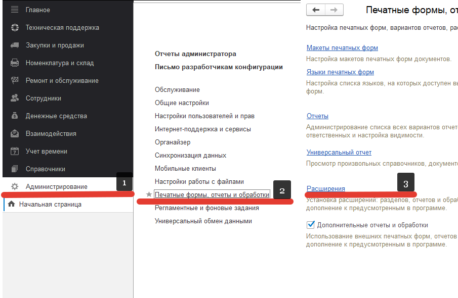
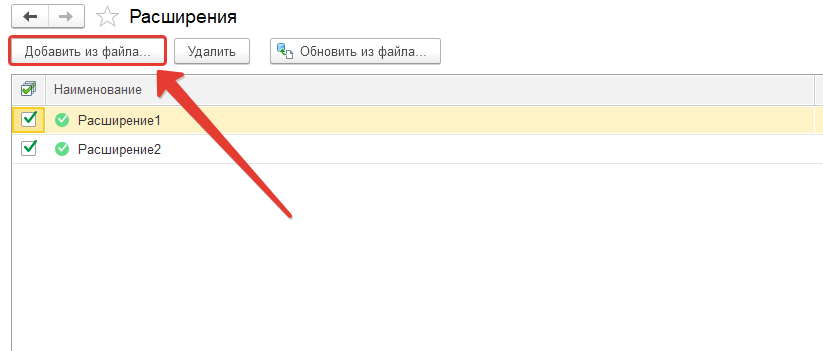
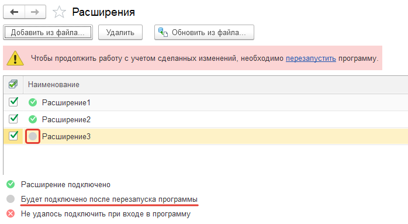
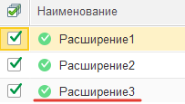
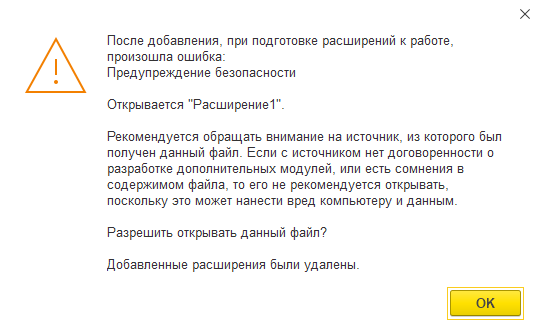

# Установка расширений из режима 1С: Предприятие

Иногда возникает такая необходимость, когда нужно дополнить, изменить или исправить конфигурацию. Для этих случаев реализован механизм расширений.
***Расширения*** – *это механизм, позволяющий вести доработки конфигурации, сохраняя ее на поддержке. Расширения конфигурации позволяют значительно упростить адаптацию прикладного решения к потребностям конкретного внедрения, конкретного заказчика.*

Для того, чтобы загрузить расширение нужно, зайти в раздел: **«Администрирование» -> «Печатные формы, отчеты и обработки» -> «Расширения»**:

В открытом окне можно увидеть уже загруженные расширения, добавим свое, нажав на кнопку **«Добавить из файла…»** и выбрать то расширение, которое мы хотим установить:

После того как было добавлено расширение, необходимо применить изменения, сделав перезагрузку программы:

У расширения, которое было добавлено изменился статус на «Подключено» 

P.S. Если в ходе добавление расширения вы столкнулись с похожей ошибкой, то необходимо у всех уже подключенных расширений убрать **«Безопасный режим»** и повторить подключение снова:

