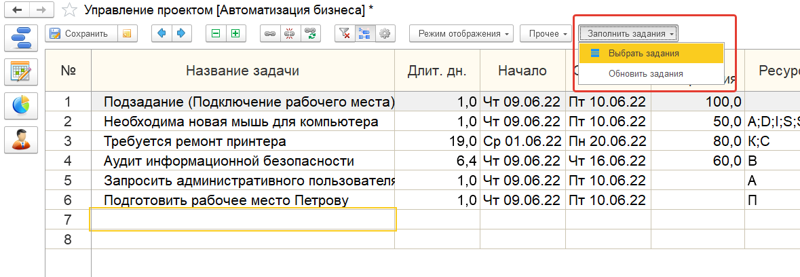

# Заполнение из документов «Задания».

## Заполнение списка проектных задач из документов «Задания».

 В меню **[Заполнить задания]** есть пункт **[Выбрать задания]**, с помощью него открывается список заданий, у которых указан текущий проект.

Выделив нужные и нажав «Выбрать», получим заполненный список задач. В список задач из заданий будут перенесены некоторые реквизиты.

!!!
Например: название и процент выполнения. Если заполнены даты SLA, то заполнятся дата планируемого начала и дата планируемого окончания.
!!!
Также буду заполнены ресурсы. Текущий исполнитель перейдет в трудовой ресурс, а если заполнена вкладка «Номенклатура», тогда заполнятся и материальные ресурсы.

Помимо команды **[Выбрать задания]** еще есть команда **[Обновить задания]**. С помощью этой команды, если в исходных заданиях были изменения, то они будут перенесены в проектные задачи.

При открытии списка заданий отображаются только задания этого проекта и только те, которые еще не добавлены. Но с помощью «Задания без проекта», можно отобразить задания, у которых не указан проект и добавить их. При сохранении «Управления проектами» таким заданиям будет установлен проект.

Данный функционал доступен с версии **3.1.14.3**.
