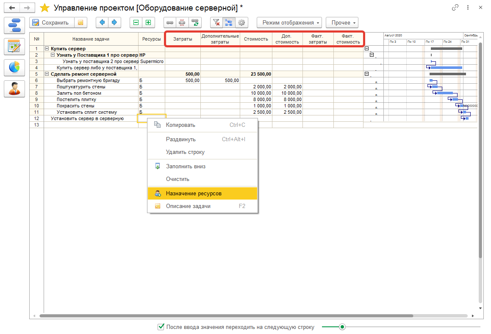

# Затраты по проекту

Если вы хотите получить красочные отчеты и узнать как это все выглядит в отчетах по проекты, то эту статью можно пропустить и перейти в статью отчетность по проекту.
Затраты могут быть как фактические, так и планируемые.  
Планируемые мы можем ввести в любое время, я фактические уже по факту, когда они становятся известны.  
Затраты на ресурсы вычисляются на основе ставок оплаты, затрат на использование, фиксированных затрат и общих затрат на затратные ресурсы.
Нажмем на форме **"Режим отображения > Затраты"** и откроем вариант представления данных в режиме затрат.

Из этой же формы можно назначить ресурсы для [проектной задачи](https://softonit.ru/FAQ/courses/?COURSE_ID=1&LESSON_ID=739). Суммы затрат можно ввести вручную став на нужную ячейку нужной задачи.