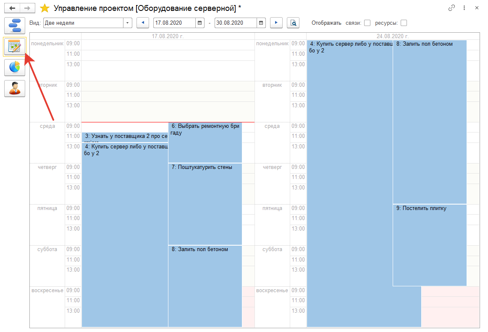

# Календарное планирование

Календарь проекта можно включить на закладке:

Здесь можно настроить за какой период необходимо отобразить проектные задачи. Щелкнув в календаре на необходимую задачу, можно открыть подробную информацию о конкретной задаче.