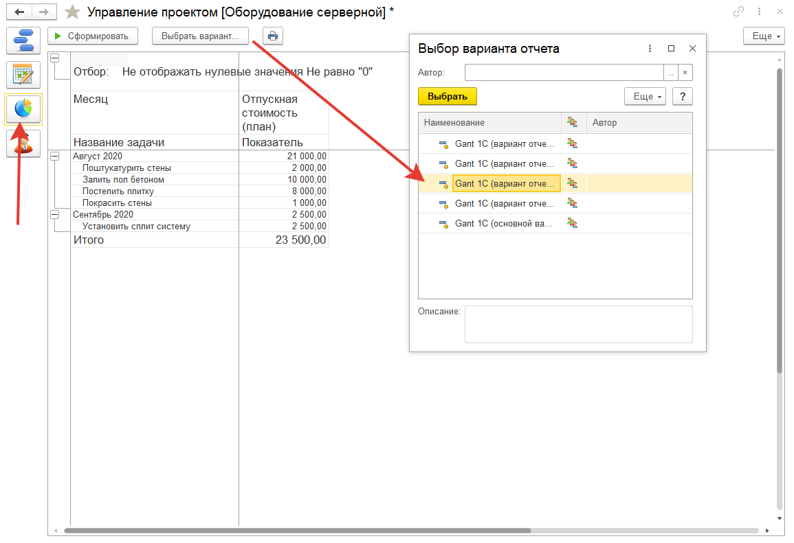

# Отчетность по проекту

**Отчетность**- это важная составляющая любого проекта. Среди отчетов в управлении проектами есть:   
* Отчет по неделям/по ресурсам
* Диаграмма
* По месяцам
* По неделям
* основной вариант

Отчеты предназначены для анализа затрат в разном представлении. Вот пример таких затрат:

