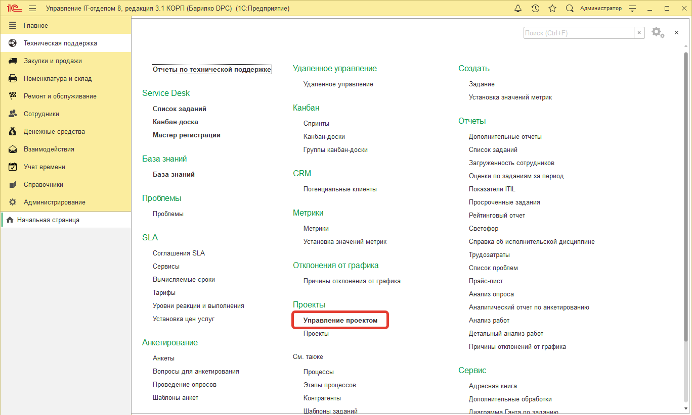
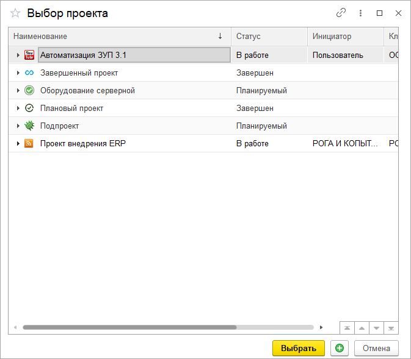
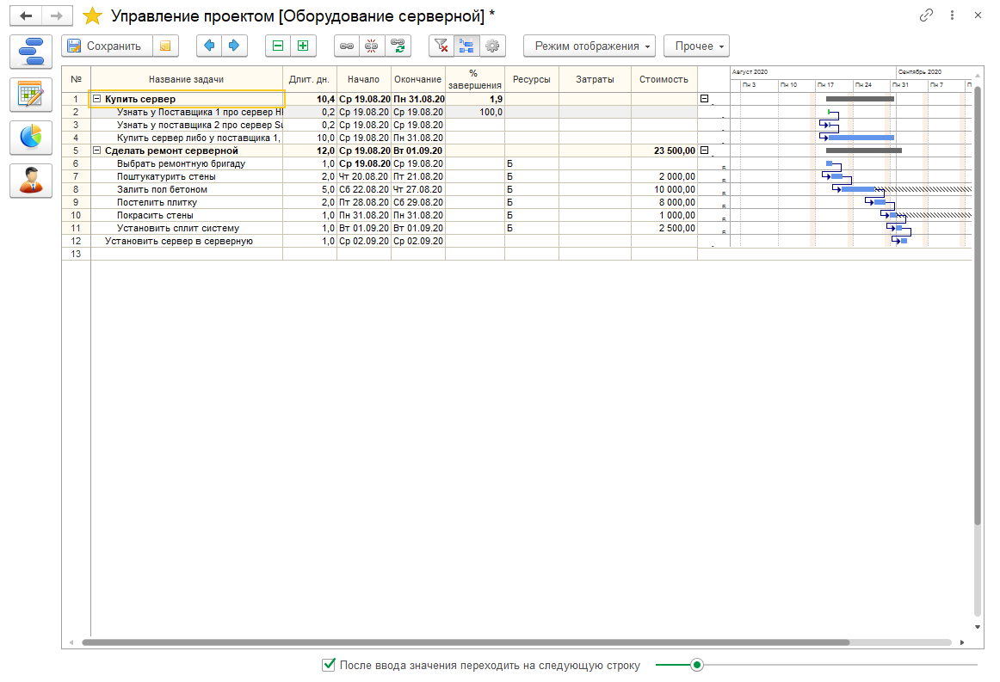
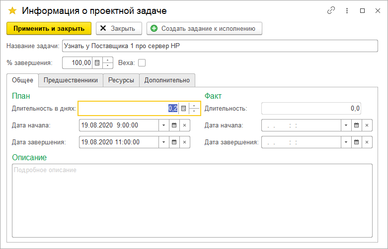
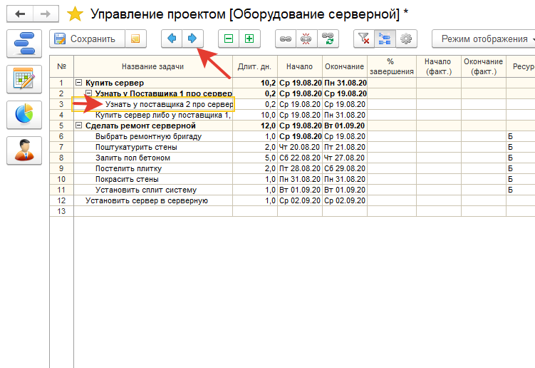
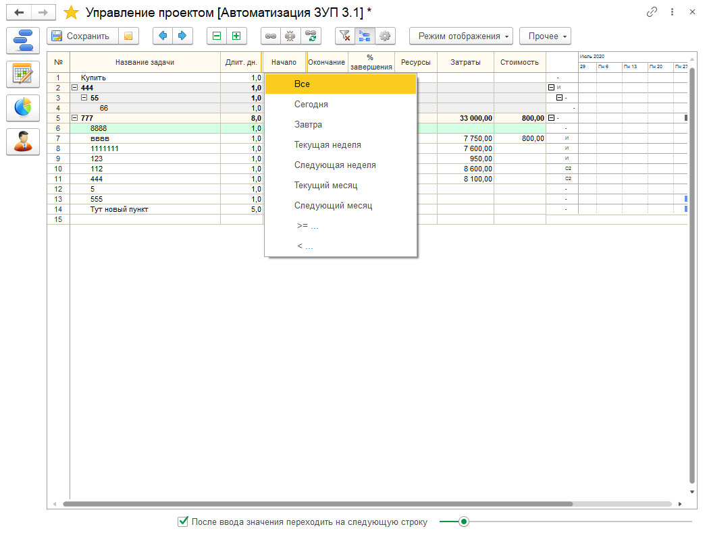

# Планирование проекта

!!!
**Внимание! Данный функционал доступен для пользователей редакции ПРОФ и КОРП начиная с версии 3.1.7.5.**
!!!

Ведение элементов справочника "Проекты" по сути - это начальный этап. Проекты связывают задачи, которые мы выполняем фактически.   
После того, как проект выбирается в задании, можно проанализировать что было ФАКТИЧЕСКИ выполнено по проекту. Но как быть, когда мы в самом начале проекта, либо вообще до него?  
Мы не знаем какие задачи будут выполнены, какие нет, а какие и вовсе будут отменены. Нам на помощь приходит Project Managment (или PM).   
Есть прекрасное ПО на эту тему MS Project, которое позволяет в виде диаграммы предложить вам схему проекта и вы сможете, рассчитать сколько нужно трудовых и материальных ресурсов, сколько проект займет времени и самое главное представить что же нужно сделать в будущем проекте.  

Сразу договоримся, что под проектом можно понимать абсолютно любую последовательность действий, которая подчинена чему-то в глобальном плане.
1. Сделать ремонт.
2. Обустроить серверную.
3. Автоматизировать бухгалтерский учет.
4. Написать программу для складского учета.
5. ...
6. 
Все это проекты. Они могут быть большими, а могут быть маленькими. Могут быть сложными, а могут легкими. Занимать один день, или длиться несколько лет.  

**С точки зрения формализации проект** - это предприятие (предпринятие) с предопределёнными целями, масштабом и длительностью (ISO/IEC 2382-20:1990). При этом мы сознательно не нигде не пишем про область управления проектом. Области могут быть абсолютно любыми.  
В конфигурации Управление IT-отделом 8 есть возможность заниматься управлением проектов.  

Для этого необходимо либо открыть форму элемента проекта, либо в глобальном меню нажать "Управление проектом".

После чего Вам будет предложено выбрать проект для управления среди уже существующих, либо там же можно создать новый.

Выбираем проект **"Оборудование серверной"**. Именно этот проект нами будет сегодня рассмотрен как основной.

Вот как он выглядит:

Наш проект состоит из двух частей, которые начинаются одновременно. Это выбор сервера и ремонт будущей серверной.

Мы вносим информацию о задачах проекта. Каждая задача имеет следующие настройки:   
* **Название задачи** - краткое представление задачи.
* **Длительность дней** - число дней, которое будет выполнять задача. Может быть не целым.
* **Начало** - дата начала планируемая.
* **Окончание** - дата окончания планируемая.
* **% завершения** - процент завершения задачи.
* **Начало (факт.)** - дата начала фактическая.
* **Окончание (факт.)** - дата окончания фактическая.
* **Ресурсы** - кто нам помогает эту задачу выполнить?
* **Затраты** - сколько мы потратим?
* **Дополнительные затраты** - какие дополнительные затраты нас ждут?
* **Стоимость** - итоговая стоимость.
* **Доп. стоимость** - дополнительная стоимость.
* **Факт. затраты** - фактические затраты.
* **Факт. стоимость** - фактическая стоимость
* 
Некоторые из этих колонок видны при соответствующем виде. Чтобы изменить вид необходимо нажать **Режим отображения.**    
Ну и конечно необходимо акцентировать свое внимание на диаграмме Ганта. Она позволяет иерархически оценить сроки и по аналогии MS Project быть **"сверху ситуации"**. Видеть все нюансы и последовательность действий с их связями.  
Нажмем правой кнопкой на нужной строке в колонке "Описание задачи" и выберем оттуда одноименный пункт (или нажмем F2). Откроется описание задачи.

Здесь можно более детально отредактировать проектную задачу. Обратите внимание, что здесь присутствует кнопка "Создать задание к исполнению".  
Эта кнопка позволяет создать документ Задание - фактическое задание исполнителям.  
То, чем мы оперируем в этом окне - это задача-план, но мы можем создать и фактическую задачу исполнителю с уведомлениями, перепиской и прочими важными атрибутами фактического исполнения.  
Так же редактировать длительность и сроки можно прямо в ячейках табличного документа.  
В самом списке можно управлять уровнем вложенности проектной задачи:

На этом же скриншоте видно есть кнопки связи двух задач. Нажатие на эту кнопку позволит связать в одну последовательность несколько задач, которые выделены в данный момент, либо отредактировать в подробной информации о задаче эти связи. Изменение связей автоматически пересчитает планируемые даты выполнения.  
После того, как мы поработали с проектом и отредактировали план проекта. Необходимо нажать на кнопку *"Сохранить"*, чтобы все изменения по проекту были сохранены.  

Так же при планировании можно использовать фильтры и отборы. Для этого необходимо два раза щелкнуть по нужному заголовку, по которому хотим сделать отбор.  
А дальше выбрать из списка нужное значение отбора. Установленный фильтр будет отображен подсказкой в заголовке (красным треугольником), после наведения на него будет отображена подсказка с фильтром.  

!!!
**Важно!** По сути этот редактор такая версия аналог Excel-файла, которая сохраняется в базе и нигде ни к чему не привязана. Но при желании можно заняться проектирование, планированием проекта по абсолютно любой методологии проектов. Это удобно, легко и понятно.
!!!