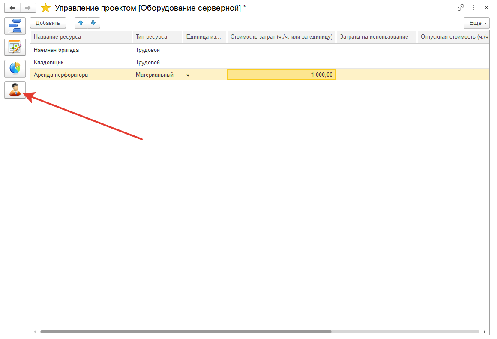

# Ресурсы проекта

**Ресурсы** - это материальная или трудовая ценность, которые обеспечивают выполнение всех задач проекта.

Ресурс может иметь какую-то фиксированную ставку при его использовании, дневную или эту сумму можно редактировать вручную.
Так же на этой форме можно указать краткое наименование ресурса (1-3 буквы), которую потом можно увидеть при проектном управлении и [распределении ресурсов.](https://softonit.ru/FAQ/courses/?COURSE_ID=1&LESSON_ID=739)