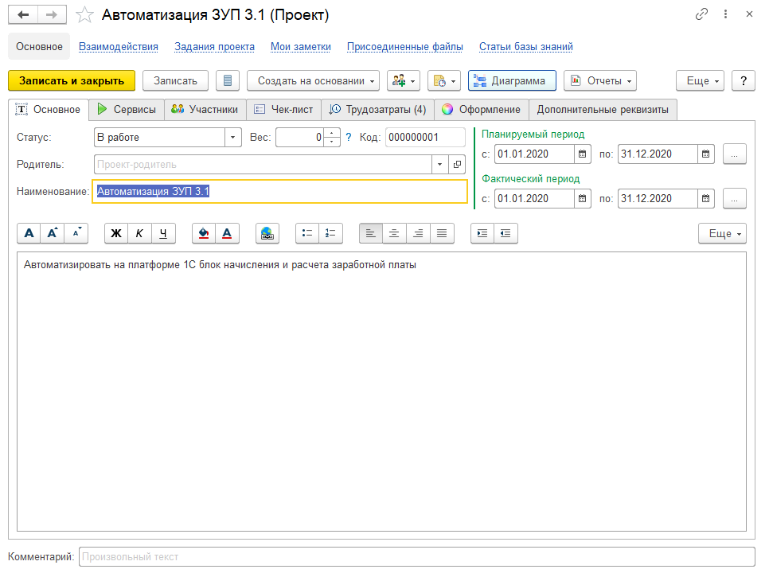

# Учет проектов

Проекты в [конфигурации](https://softonit.ru/catalog/products/it/#detail) используются как для планирования, так и для контроля фактически выполненных работ.

В проекте есть **плановые сроки и фактические.**
Так же есть возможность указать круг ответственных лиц (инициатор, руководитель, ответственный, клиент) и участников (проектную группу) проекта.

**Чек-лист** предназначен для отражения пунктов-вех, которые необходимо выполнить в рамках проекта и это чисто информативная функция. Эта своеобразная простая система отражения типа списка ToDo-дел. Если вы хотите более дательный анализ дел проекта, то необходимо воспользоваться [планированием проекта](https://softonit.ru/FAQ/courses/?COURSE_ID=1&LESSON_ID=739)

Табличная часть **"Сервисы"** отвечает за то, какие [сервисы](https://softonit.ru/FAQ/courses/?COURSE_ID=1&LESSON_ID=34) необходимо использовать для выполнения проекта. 

В каждом задании (инциденте), есть возможность указать реквизит "Проект", это позволит в дальнейшем смотреть, например, диаграмму Ганта по проекту. Или видеть все задания, которые были выполнены в рамках этого проекта.
Обратите внимание на кнопку "Диаграмма". Она будет доступна только для тех пользователей у которых редакция конфигурации ПРОФ или КОРП.
"Диаграмма" позволит [планировать проект.](https://softonit.ru/FAQ/courses/?COURSE_ID=1&LESSON_ID=739) Т.е. детально управлять предстоящими задачами проекта.