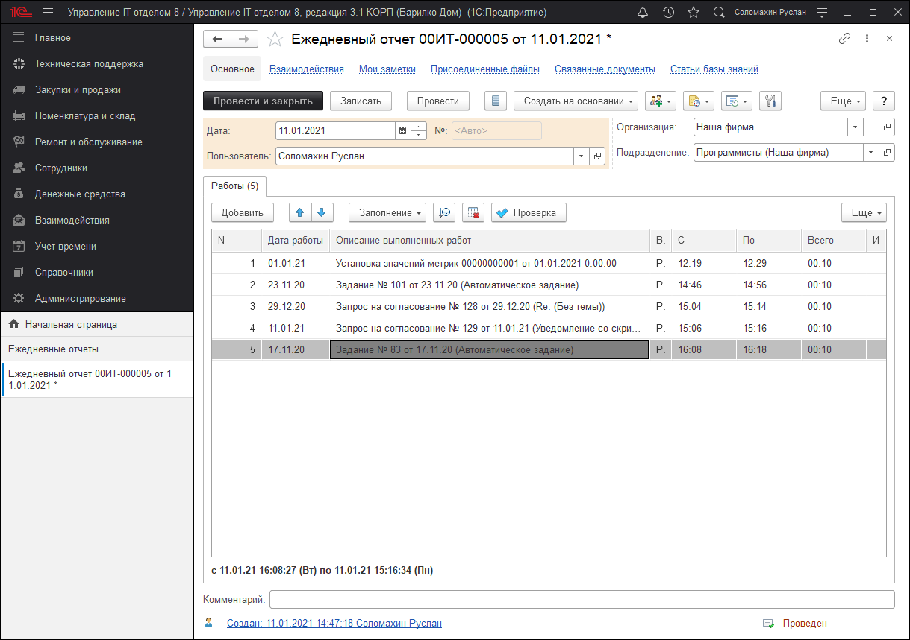
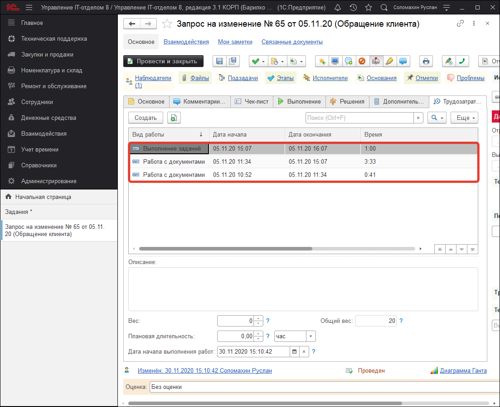

# Документ "Ежедневный отчет"

Документ формируется для одного пользователя за один день его работы. Позволяет сделать фотографию рабочего дня пользователя от начала рабочего дня до окончания.
В шапке документа располагаются следующий набор реквизитов:     
- **Отчет за.** Предназначен для указания точной даты выполненных работ, по умолчанию выставляется текущей датой создания.  
- **Пользователь.** Реквизит, в котором указывается конкретный пользователь, заполняющий текущий документ.  
- **Организация.** Автоматически указывается организация, привязанного сотрудника к текущему пользователю.    
- **Подразделение.** Автоматически указывается подразделение, привязанного сотрудника к текущему пользователю.   

Табличная часть **"Работы"** является самой важной составляющей документа, где заполняется список выполненных работ пользователем за указанный период. В панели кнопок располагаются кнопки управления и заполнения табличной части, которые рассмотрим поближе:  

- **Добавить.** С помощью этой кнопки добавляются новые данные в табличной части по одной новой строке.    
- **Вверх\вниз.** Кнопки позволяющие перемещать в табличной части по соответствующему направлению указанные работы.   
- **Заполнение.** Кнопка, позволяющая производить автоматическое добавление работ в т.ч. по определенно выбранным вариантам.       
- **Загрузить из файла.** Позволяет осуществить заполнение табличной части "Работы" путем заполнения информации из внешнего файла.   
- **По заданиям.** Заполняет табличную часть работами выполненными по заданиям на указанную в текущем документе дату.    
- **По нарядам на работы.** Заполняет табличную часть по созданным на текущую дату нарядам на работы.  
- **По все документам в которых работали.** Заполняет табличную часть работами по всем документам, в которых выполняли какие-либо действия.   
- **По трудозатратам.** Заполняет табличную часть по всем документам, где были указаны, либо ручные, либо автоматические трудозатраты.   
- **Сортировать по времени.** Осуществляет сортировку указанных работ по времени от наименьшего к большему.    
- **Очистить табличную часть.** Позволяет быстро полностью очистить табличную часть "Работы".   
- **Проверка.** Осуществляет проверку заполненных данных табличной части на пересечение интервалов времени.   

При настройке автоматической установки трудозатрат в документе "Задание", системой в автоматическом режиме проставляются трудозатраты на соответствующей закладке "Трудозатраты" с установленным видом работ. Определенный вид работ устанавливается системой исходя из выполняемых действий в задание. Так, например, если задание было создано (вручную) или просто открыто, тогда будет установлен вид работ "Работа с документами". Если в задаче изменяется исполнитель или останавливается таймер хронометража, тогда у трудозатрат устанавливается вид "Выполнение заданий". Это два автоматически выставляемых вида работ, остальные используются вручную. 

