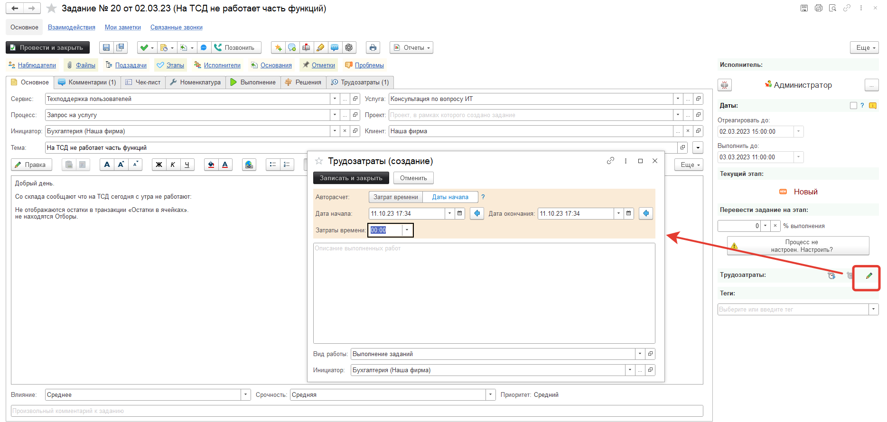
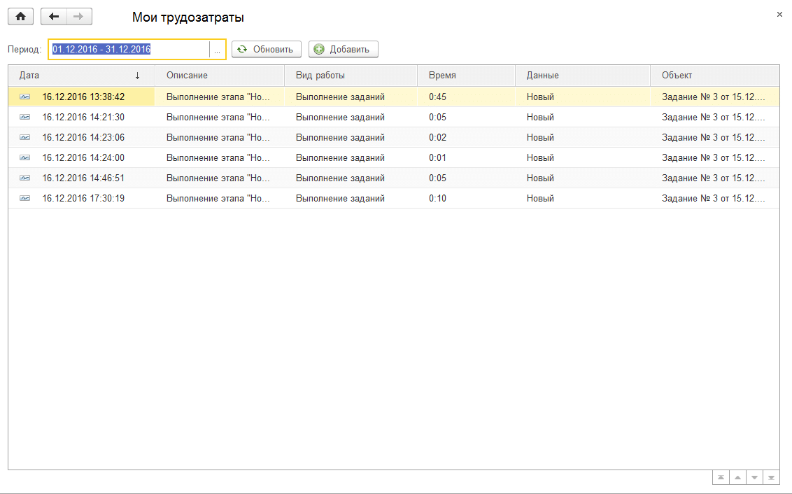
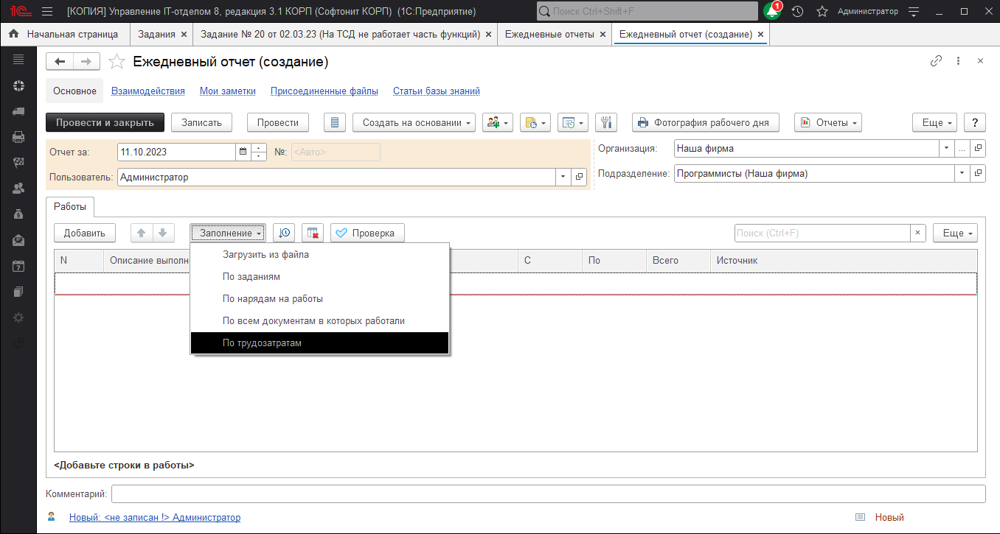

# Учет трудозатрат сотрудников

В документе "Задание", при нажатии на кнопку "Ввести показатели трудозатрат" (кнопка с зеленым карандашом), пользователю открывается форма ввода показателя времени:

В форме необходимо указать "Затраты времени". При использовании хронометража, это поле заполняется автоматически, а сама форма отображается пользователю при остановке хронометража (старт хронометража осуществляется по кнопке с секундомером).
После внесения трудозатрат, просмотреть ранее указанные трудозатраты можно в разделе **"Учет времени" - "Мои трудозатраты"**.

На основе внесенных данных в дальнейшем можно создать документ **"Ежедневный отчет"**.

Если в настройках пользователя включить настройку **"Автохронометраж в документах"**, то при открытии документа "Задание", в котором текущий пользователь является текущим исполнителем, то хронометраж будет запущен автоматически, а при закрытии формы документа остановлен.
