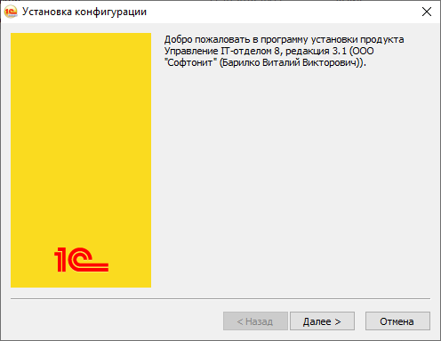
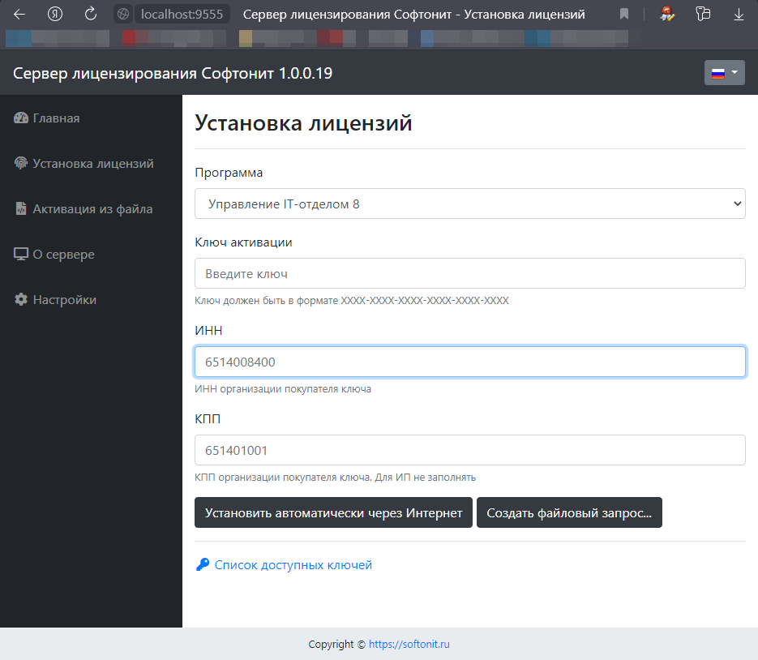
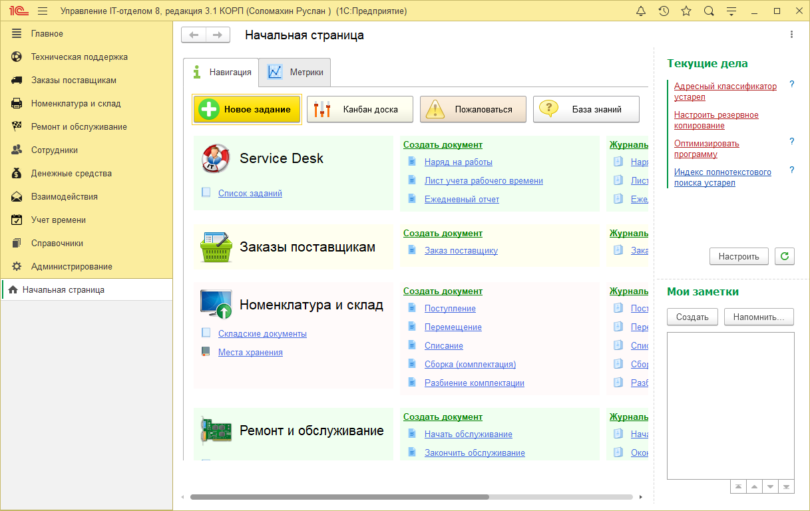
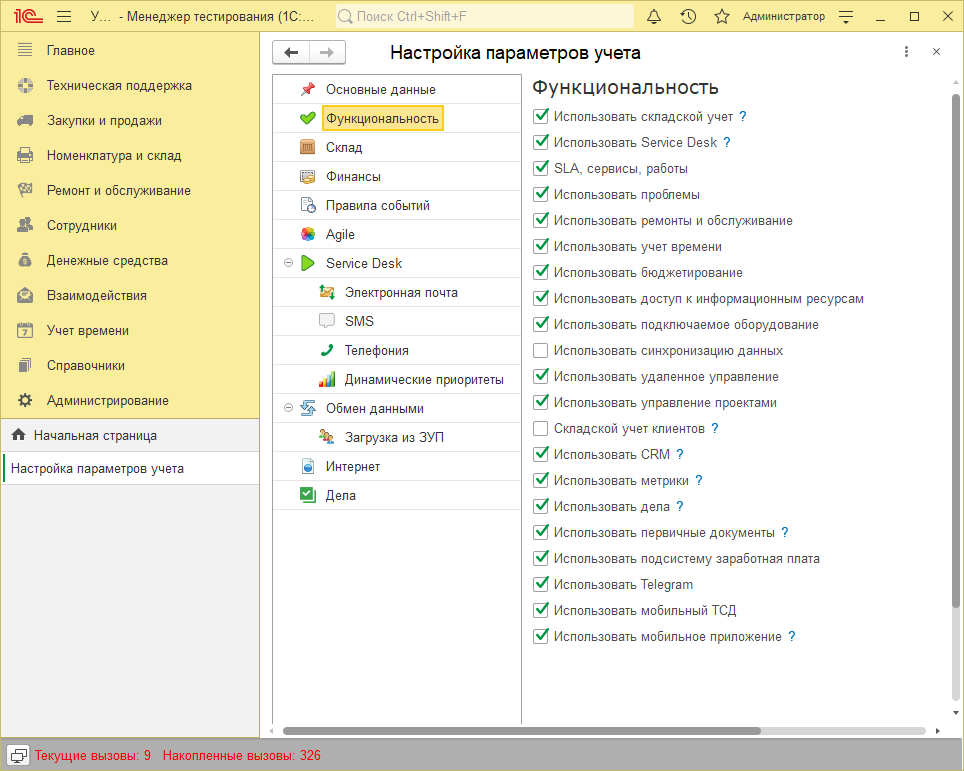
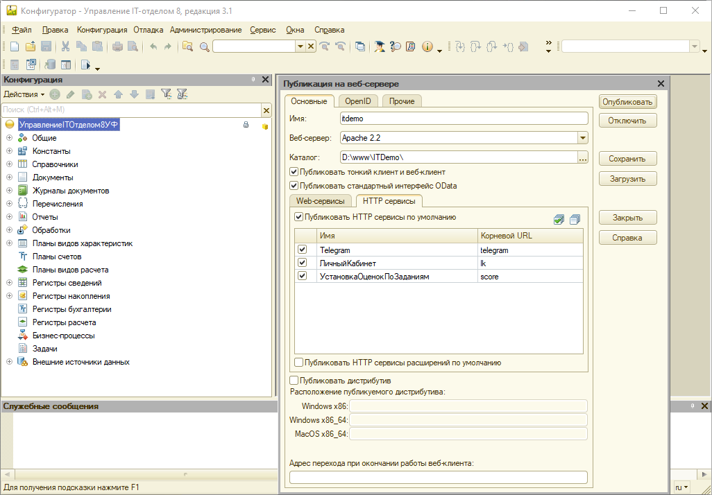
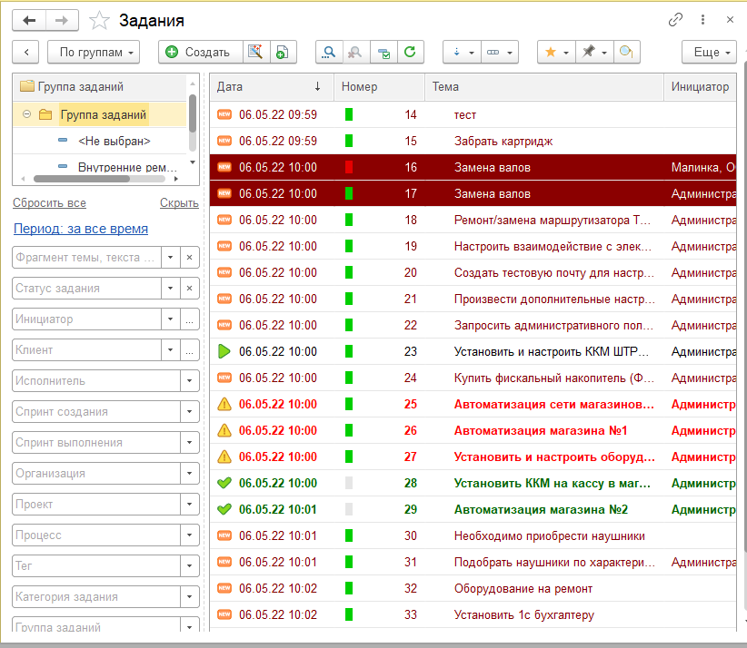
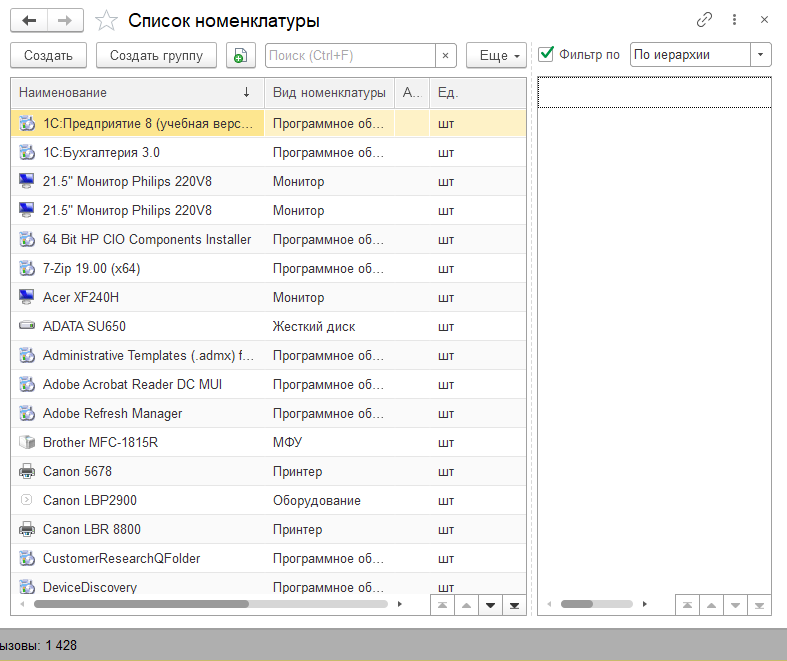

# Чек-лист "Внедрение"

## Внедрение конфигурации "Управление IT-отделом 8"

### Шаг 1: Установка программы

Скачайте дистрибутив из личного кабинета и установите конфигурацию на ПК.

[Подробная инструкция по установке](https://softonit.ru/FAQ/courses/?COURSE_ID=1&LESSON_ID=4&LESSON_PATH=1.2.4)

### Шаг 2: Активация программы

После успешной установки необходимо произвести активацию программы.

[Подробная инструкция по активации](https://softonit.ru/FAQ/courses/?COURSE_ID=1&CHAPTER_ID=0582&LESSON_PATH=1.2.582)

### Шаг 3: Знакомство с программой

Перед тем, как приступить к работе с конфигурацией необходимо
ознакомиться с терминами и определениями. Изучить важную информацию перед стартом.

[Основные термины и определения](https://softonit.ru/FAQ/courses/?COURSE_ID=1&LESSON_ID=580&LESSON_PATH=1.579.580)  
[Полезная информация](https://softonit.ru/FAQ/courses/?COURSE_ID=1&LESSON_ID=581&LESSON_PATH=1.579.581)

### Шаг 4: Настройка функционала

На данном этапе необходимо определиться для каких целей будет использоваться программа.

1. Техническая поддержка(Service Desk).
2. Ведение складского учета.
3. Объединено.

После того как определились, нужно настроить функционал конфигурации под наши нужды. В качестве сквозного примера внедрим "Объединенный" вариант работы.

[Настройка функционала](https://softonit.ru/FAQ/courses/?COURSE_ID=1&LESSON_ID=599&LESSON_PATH=1.2.597.599)
[Персональные настройки](https://softonit.ru/FAQ/courses/?COURSE_ID=1&LESSON_ID=139&sphrase_id=3128544)
[Общие настройки](https://softonit.ru/FAQ/courses/?COURSE_ID=1&LESSON_ID=120&LESSON_PATH=1.117.120)

### Шаг 5: Заполнение справочников

Приступим к заполнению справочников и к созданию пользователей конфигурации. Заполнить
справочники можно не только вручную, но и с помощью импорта данных. Конфигурация поддерживает
обмен с другими 1С конфигурациями, а также позволяет импортировать данные из `AIDA64` и `WMI`.

[Заполнение справочников](https://softonit.ru/FAQ/courses/?COURSE_ID=1&CHAPTER_ID=0601&LESSON_PATH=1.2.597.601)  
[Создание первого пользователя](https://softonit.ru/FAQ/courses/?COURSE_ID=1&LESSON_ID=446&sphrase_id=3141121)  
[Импорт данных](https://softonit.ru/FAQ/courses/?COURSE_ID=1&LESSON_ID=689)  

### Шаг 6: Публикация базы

После заполнения справочников и создания дополнительных пользователей, перейдем к публикации базы данных на веб-сервере.
А также опубликуем дополнительные http-сервисы, которые позволят использовать мобильное приложение, личный кабинет, Telegram и установку оценок по заданиям.

[Публикация базы](https://softonit.ru/FAQ/courses/?COURSE_ID=1&CHAPTER_ID=0590&LESSON_PATH=1.2.590)  
[Публикация и настройка HTTP-сервисов](https://softonit.ru/FAQ/courses/?COURSE_ID=1&CHAPTER_ID=0593&LESSON_PATH=1.2.590.593)  
[Мобильное приложение](https://softonit.ru/FAQ/courses/?COURSE_ID=1&CHAPTER_ID=0498&LESSON_PATH=1.498)  

### Шаг 7: Настройка Service Desk

После заполнения справочников и публикации конфигурации на веб-сервер, перейдем к настройки механизма **"Service Desk"**. Первым делом необходимо ознакомиться со схемой работы функционала **"Техническая поддержка"**. Далее настраиваем функционал создание заданий из электронных писем, а также соглашения SLA. После это необходимо настроить работу с документом **"Задание"**.

[С чего начать?](https://softonit.ru/FAQ/courses/?COURSE_ID=1&LESSON_ID=144&LESSON_PATH=1.22.144)  
[Создание заданий из электронных писем](https://softonit.ru/FAQ/courses/?COURSE_ID=1&CHAPTER_ID=0624&LESSON_PATH=1.22.25.624)  
[Соглашения SLA](https://softonit.ru/FAQ/courses/?COURSE_ID=1&CHAPTER_ID=032&LESSON_PATH=1.22.32)  
[Документ "Задание"](https://softonit.ru/FAQ/courses/?COURSE_ID=1&CHAPTER_ID=025&LESSON_PATH=1.22.25)  

### Шаг 8: Настройка подсистемы "Номенклатура и склад"

Для начала ведения учета необходимо занести в программу всю номенклатуру, а также карточки номенклатуры. После того, как вся техника добавлена в программу можно вести учет оборудования. Использовать складские документы, которые предусмотрены в конфигурации, также учитывать заказы клиентов или заказы поставщиков, отражать ремонт и обслуживание оборудования.

[Номенклатура](https://softonit.ru/FAQ/courses/?COURSE_ID=1&CHAPTER_ID=047&LESSON_PATH=1.44.47)  
[Карточка номенклатуры](https://softonit.ru/FAQ/courses/?COURSE_ID=1&CHAPTER_ID=0662&LESSON_PATH=1.44.662)  
[Складские документы](https://softonit.ru/FAQ/courses/?COURSE_ID=1&CHAPTER_ID=053&LESSON_PATH=1.44.53)  
[Заказы поставщику](https://softonit.ru/FAQ/courses/?COURSE_ID=1&CHAPTER_ID=0695&LESSON_PATH=1.40.695)  
[Заказы клиентов](https://softonit.ru/FAQ/courses/?COURSE_ID=1&CHAPTER_ID=0699&LESSON_PATH=1.40.699)  
[Ремонт и обслуживание](https://softonit.ru/FAQ/courses/?COURSE_ID=1&CHAPTER_ID=074&LESSON_PATH=1.74)  
[Импорт из AIDA64 и WMI](https://softonit.ru/FAQ/courses/?COURSE_ID=1&LESSON_ID=619)  

